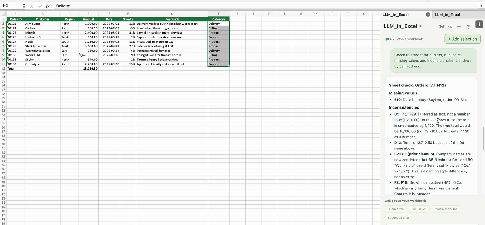

# LLM_in_Excel

[← LLM_in_Work](../README.md) · [LLM_in_Word](../LLM_in_Word/README.md) · [LLM_in_PowerPoint](../LLM_in_PowerPoint/README.md) · [LLM_in_Overleaf](../LLM_in_Overleaf/README.md)

**Your local Claude Code or Codex CLI, right inside Microsoft Excel.**

English · [简体中文](README.zh-CN.md)

Select some cells, describe what to do, review the changed cells, and apply. Clean up names, sort feedback into categories, write formulas, fill blanks, or ask questions about the workbook. Only cells that change are written, so fonts, fills and number formats stay as they were, and ID numbers such as `00123` stay text. LLM_in_Excel brings this workflow into an Excel side pane and reuses the login of your locally installed CLI.

[Windows installation](#windows-installation) · [macOS installation](#macos-installation) · [First edit](#your-first-edit) · [Troubleshooting](docs/troubleshooting.md) · [Contributing](CONTRIBUTING.md)


*Real desktop Excel on macOS with the LLM_in_Excel side pane. Demo workbook written for the screenshots.*

## What you can do

| Feature | In practice |
| --- | --- |
| Clean up and standardize | Remove stray spaces, unify capitalization and spelling of names and regions, fix typos, or translate cells. |
| Fill a column | Select an empty column next to your data, for example a *Category* column, and have each row filled from the other columns in that row. |
| Write formulas | Describe the calculation; the model writes Excel formulas with English function names, and the pane reports any cell that ends up with an error such as `#NAME?`. |
| Pick targets the way you work | Add a selected range, several ranges at once (Cmd/Ctrl-click), an empty range to fill, or a whole column (trimmed to the used rows). Up to **8** ranges per request, 4,000 cells in total. |
| Review before applying | Each target gets a cell preview with row numbers and column letters. Changed cells show the old value struck through; new cells next to the target are marked separately. Nothing changes until you choose Apply. |
| Keep formatting and data types | Only changed cells are written, and the pane never changes fonts, fills or number formats. Values are entered as if you typed them, so numbers stay numbers; IDs such as `00123` stay text; an amount like `¥1,300` going into a number cell is written as the number 1300, so the cell's currency format still applies. |
| Undo with one click | Each applied card has **↩ Undo**, which restores every written cell's content and number format and puts the target back. |
| Ask about the workbook | **Workbook Q&A** summarizes, finds outliers, duplicates, gaps and inconsistencies, explains formulas, or suggests charts, citing cell addresses. |
| Continue a conversation | Refine an answer, keep input drafts, revisit local history, attach reference files, or export a conversation as Markdown. |
| Switch interface language | Choose English or 中文 without restarting the pane. Explanations follow the language of your instruction. |
| Choose your engine | Switch between Claude Code and Codex; choose a model and its supported reasoning effort. |

## See the workflow in Excel

**1. Add targets and describe the change.** Select the cells to change and click **＋ Add selection**. Hold Cmd (Mac) or Ctrl (Windows) to select several ranges; each becomes its own target. An empty range works too, for a column you want filled. Then type one instruction, or click a preset such as **Clean up** or **Categorize**.

**2. Preview each target.** The cell preview lists only the rows and columns that change. In the screenshot above, stray spaces and inconsistent capitalization in the *Customer* and *Region* columns are fixed; the workbook does not change until you apply.

**3. Apply.** Click **Apply** on a card, or **Apply all** when there are several. Below, the *Category* column was filled from the feedback in column G: ten cells written, formatting untouched, and an **↩ Undo** button on the card.


**4. Ask about the workbook.** Click **Rewrite ▾** and switch to **Workbook Q&A**. Presets summarize the sheet, look for problems, explain formulas or suggest a chart. Answers name the cells they refer to, so you can find them in the sheet.



The screenshots come from real desktop Excel (16.109) on macOS with a workbook written for the demo. Every reply was generated by Claude Code (Haiku 4.5, low effort). [Screenshot notes](docs/images/README.md).

## Platform support

| Platform | Installation and runtime | Verification |
| --- | --- | --- |
| **macOS desktop Excel** | Shell installer; reuses an already trusted certificate from LLM_in_Word or LLM_in_PowerPoint, otherwise Keychain trust; launchd service; Excel sideloading | Offline tests against an Excel stand-in, plus the full workflow in real Excel 16.109 (cleanup, filling an empty column, IDs and currency amounts, formulas, several ranges at once, undo). |
| **Windows desktop Excel** | Native PowerShell installer; user certificate trust; Excel registration; background service and login startup | Windows CI covers install, update, restart, HTTPS and uninstall. Interactive Excel on Windows still needs a real-device acceptance run. |
| Excel for the web / mobile | No supported installation workflow | Not supported in this release. |
| Linux | Backend development and browser preview | Offline tests only. |

Use a current **Microsoft 365 desktop Excel**. The manifest requires ExcelApi 1.9 (Excel 2019 or later). Refusing ranges with merged cells needs ExcelApi 1.13; on older versions, avoid adding merged cells as targets.

## Before installation

You need:

1. **Node.js 22.12+ on the 22.x line, or Node.js 24+.** Install from [Node.js](https://nodejs.org/en/download).
2. **Git**, or an extracted ZIP of this repository.
3. At least one local, authenticated CLI: [Claude Code setup](https://code.claude.com/docs/en/setup) or [Codex CLI](https://github.com/openai/codex).

In the terminal of the same OS user that runs Excel, verify the CLI you intend to use:

```text
node --version
claude --version
claude auth login
```

Or, for Codex: `codex --version` and `codex login`. You only need one backend. On Windows use a **native Windows CLI**, not one installed only inside WSL.

## Windows installation

```powershell
git clone https://github.com/ZJU-OmniAI/LLM_in_Work.git
cd LLM_in_Work/LLM_in_Excel
powershell.exe -NoProfile -ExecutionPolicy Bypass -File .\install.ps1
```

`Bypass` applies to this PowerShell process only. Windows may ask you to confirm trust for the generated localhost certificate. The installer copies the runtime to `%LOCALAPPDATA%\LLM_in_Excel\app`, trusts the certificate for **your user** only, registers `manifest.xml` as a developer add-in, starts a hidden background service on `127.0.0.1:8397`, adds a per-user Startup shortcut, and checks the service over HTTPS.

Completely close and reopen Excel, then open **Home → Add-ins → Developer Add-ins → LLM_in_Excel** (in some versions **Insert → My Add-ins**). Once loaded, an **LLM_in_Excel** button appears on the Home ribbon.

## macOS installation

```bash
git clone https://github.com/ZJU-OmniAI/LLM_in_Work.git
cd LLM_in_Work/LLM_in_Excel
./install.sh
```

The installer copies runtime files to `~/.llm_in_excel/app`, registers the user launchd service `com.llm_in_excel.server` on port 8397, and places the manifest in Excel's sideload folder. **If LLM_in_Word or LLM_in_PowerPoint is already installed, its trusted localhost certificate is reused**, so there is no password prompt (a certificate is tied to `localhost`, not to a port). Otherwise the first installation asks for your Mac password once to trust a new certificate.

Quit Excel with **Cmd+Q**, reopen it, then click **LLM_in_Excel** on the Home ribbon. If the button is missing, choose **Insert → Add-ins → My Add-ins → Developer Add-ins → LLM_in_Excel** once. See [Microsoft's Mac sideloading guide](https://learn.microsoft.com/en-us/office/dev/add-ins/testing/sideload-an-office-add-in-on-mac).

LLM_in_Word (port 8377), LLM_in_PowerPoint (8387) and LLM_in_Excel (8397) are separate services and can run side by side.

## Your first edit

1. Open a copy of a workbook and open the **LLM_in_Excel** side pane.
2. Click **Settings** to choose **English** if needed, **Claude Code** or **Codex**, and a model. The dot next to the title shows the connection; click the status line in **Settings** for sign-in and path help.
3. Select the cells to change, for example the *Customer* column's data rows, and click **＋ Add selection**. Add more ranges if needed. **Settings** lists the targets with their sheet and address, with buttons to locate (📍) or remove each one.
4. Enter an instruction, such as **“Remove stray spaces and use title case for company names.”**, or click a preset.
5. Click **Rewrite**. The response streams into the pane; you can stop it at any time.
6. Inspect the cell preview and click **Apply** (or **Apply all**).
7. Check the sheet. If you do not like the result, click **↩ Undo** on the card: it restores the cells and puts the target back.

To fill a new column, select its empty cells next to your data (for example `H2:H11`) and describe what goes in: **“Sort the feedback in column G into Delivery / Billing / Product / Support.”** For questions, click **Rewrite ▾** and switch to **Workbook Q&A**.

| Chinese control | Meaning |
| --- | --- |
| 设置 | Settings: model, language, mode and targets |
| 改写 ▾ / 问答 ▾ | Current mode; click to switch |
| 改写单元格 / 表格问答 | Edit cells / Workbook Q&A |
| ＋ 添加选中 | Add the selected range(s) as targets |
| 单元格预览 | Cell preview |
| 应用 / 撤销 | Apply / Undo |
| 生成改写 / 停止生成 | Generate / Stop |

## How applying works

A target is remembered by its worksheet ID and address, together with a snapshot of its cells. Before writing, the pane reads the range again: if its contents changed after the request was sent, you are asked to confirm (click **Apply** once more); if the sheet is gone, nothing is written.

The model answers with a table that carries row numbers and column letters, so it may list only the rows and columns that change. A blank cell in the reply means “leave as is”; clearing a cell takes an explicit `""`, and the preview marks it *(cleared)*. Each listed cell is compared with the current one, and unchanged cells are skipped: `1,200.00` and `1200` are the same number, and a formula whose result was copied back keeps its formula. A reply may also fill **empty** cells outside the target, such as a Total row below it; the preview marks them separately. Cells outside the target that already have content are never overwritten.

Changed cells are written as if typed: numbers, dates and percentages become values, text starting with `=` becomes a formula, and a leading `'` keeps text as text. The pane does not set fonts, fills or number formats. The written cells are read back: formula errors and numbers that turned into text are reported on the card. **Undo** writes back each cell's original formula or value, value type and number format, unless the cell was edited again after applying.

## What does the model receive?

**Selecting one column does not mean the model sees only that column.** The targets determine where edits may be applied. The sheets that contain targets, and the active sheet, are sent as tables with row numbers and column letters, formulas shown with their current results. Other sheets are sent as a short preview. Large sheets keep the header rows and the rows around each target, and name the omitted rows, within about 110,000 characters. Hidden sheets are included and marked as hidden. Cell comments, charts and pivot tables are not included. Reference files are sent only when you attach them.

The backend runs locally and binds to `127.0.0.1:8397`, but model inference normally connects to the chosen provider. Your CLI's authentication, provider settings, account limits and billing apply, and CLI history may retain prompts and cell contents. Read [data handling and security](SECURITY.md) before using confidential workbooks.

## Update and manage the service

```text
git pull --ff-only
npm run update
```

Then click ⟳ in the pane. Manifest changes require completely restarting Excel.

macOS restart: `launchctl kickstart -k gui/$(id -u)/com.llm_in_excel.server` (log: `~/.llm_in_excel/server.log`).
Windows: `powershell.exe -NoProfile -ExecutionPolicy Bypass -File .\tools\windows-service.ps1 -Action Restart` (log: `%LOCALAPPDATA%\LLM_in_Excel\server.log`).

## Configuration

Installers persist these for the background service; set them before running `npm run update` to change them.

| Environment variable | Purpose | Default |
| --- | --- | --- |
| `LLM_IN_EXCEL_CLAUDE_BIN` | Claude executable or JS entry point | Automatic discovery |
| `LLM_IN_EXCEL_CODEX_BIN` | Codex executable or JS entry point | Automatic discovery |
| `LLM_IN_EXCEL_TIMEOUT_MS` | Total time allowed for one CLI request | `300000` |
| `LLM_IN_EXCEL_MAX_CHARS` | Server-side cap on workbook text | `120000` |
| `LLM_IN_EXCEL_DATA_DIR` | Data directory for direct server runs | `~/.llm_in_excel` |
| `LLM_IN_EXCEL_PORT` | Port for direct server runs | `8397` |

Changing the installed port also requires editing every localhost URL in `manifest.xml`. Keep `localhost`, `127.0.0.1` and `::1` excluded from your system proxy.

## Development and tests

```text
npm ci
npm test
npm run preview
```

`npm test` runs the offline suite: addresses and the cell table protocol, write planning, workbook context, the pane against an Excel stand-in (`tools/fixtures/fake-excel.js`, which types values the way Excel does), the interface, translations, prompts and the backend with mock CLIs. Browser preview runs at `http://127.0.0.1:8399/taskpane.html`; reading and writing cells requires the real add-in. Optional live backend tests (`npm run test:live`, `npm run test:live:codex`) consume provider usage.

See [architecture](docs/architecture.md), [contributing](CONTRIBUTING.md) and the [changelog](CHANGELOG.md).

## Limitations

- Ranges with merged cells are not accepted as targets; unmerge them first.
- The pane writes cell contents only: it does not change formatting, add sheets, sort or filter, or create charts and pivot tables. Q&A can explain how to do those.
- Up to 8 targets, 2,000 cells each and 4,000 cells in total per request. Very large sheets are sent in part.
- The model can make mistakes, especially with arithmetic. Prefer asking for formulas, and check numbers yourself.

## Uninstall

macOS: `./install.sh --uninstall` (or `npm run uninstall`). This stops the service and removes the manifest; local data in `~/.llm_in_excel` and the Keychain certificate (which LLM_in_Word or LLM_in_PowerPoint may share) are kept.

Windows: `powershell.exe -NoProfile -ExecutionPolicy Bypass -File .\tools\windows-service.ps1 -Action Uninstall`. This stops the service, removes the Startup shortcut and Excel registration, and removes this install's certificate from your user stores. Delete `%LOCALAPPDATA%\LLM_in_Excel` manually if you no longer need it.

## License

[MIT](../LICENSE). Office.js, model CLIs and their services remain subject to their respective licenses and terms. LLM_in_Excel is an independent ZJU-OmniAI project, not an official Microsoft, Anthropic or OpenAI product.
