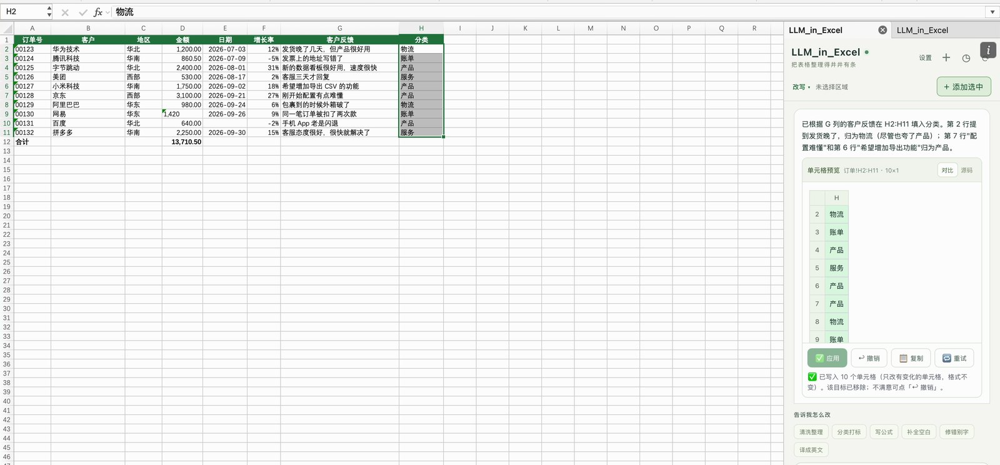

# LLM_in_Excel

[← LLM_in_Work](../README.zh-CN.md) · [LLM_in_Word](../LLM_in_Word/README.zh-CN.md) · [LLM_in_PowerPoint](../LLM_in_PowerPoint/README.zh-CN.md) · [LLM_in_Overleaf](../LLM_in_Overleaf/README.zh-CN.md)

**把本机的 Claude Code 或 Codex CLI 装进 Microsoft Excel。**

[English](README.md) · 简体中文

选中一些单元格，说出要做什么，预览要改的单元格后一键应用。可以清洗整理客户名和地区、按反馈给每一行分类、写公式、补全空白，也可以就整个工作簿提问。只写入有变化的单元格，所以字体、底色和数字格式都保持原样，`00123` 这样的编号也仍然是文本。LLM_in_Excel 把这套流程放进 Excel 的侧边栏，直接沿用你本机 CLI 的登录状态。

[Windows 安装](#windows-安装) · [macOS 安装](#macos-安装) · [第一次改写](#第一次改写) · [故障排查](docs/troubleshooting.md) · [参与贡献](CONTRIBUTING.md)


*macOS 上真实的桌面版 Excel 与 LLM_in_Excel 侧栏，工作簿为截图专门编写。*

## 能做什么

| 功能 | 具体用法 |
| --- | --- |
| 清洗整理 | 去掉多余空格，统一公司名、地区名的大小写和写法，修错别字，或者把单元格译成英文。 |
| 填一整列 | 选中数据旁边的一列空白单元格（比如「分类」列），让模型根据同一行其他列的内容逐行填写。 |
| 写公式 | 描述要算什么，模型写出 Excel 公式（英文函数名）；写入后如果有单元格算出 `#NAME?` 之类的错误，面板会列出来。 |
| 按习惯选目标 | 可以添加选中的一块区域、一次选中的几块区域（按住 Cmd/Ctrl 多选）、要填写的空白区域，或者整列（自动截到有数据的行）。一次最多 **8** 块，合计 4,000 个单元格。 |
| 先预览再应用 | 每个目标一张单元格预览，带行号和列字母：有变化的单元格划掉旧值、显示新值，目标旁边新增的单元格单独标出。点「应用」之前表格不会有任何变化。 |
| 保留格式和数据类型 | 只写入有变化的单元格，面板不改字体、底色和数字格式。写入方式和手动输入一样：数字仍是数字；`00123` 这样的编号仍是文本；往数字单元格里写 `¥1,300` 这样的金额时会写成数字 1300，单元格原来的货币格式照样生效。 |
| 一键撤销 | 应用后的卡片上有「↩ 撤销」：把写过的每个单元格恢复成原来的内容和数字格式，并把目标放回列表。 |
| 对整个工作簿提问 | 「表格问答」可以总结、找异常值和重复、缺失、前后不一致，解释公式，推荐图表，回答会注明单元格地址。 |
| 连续对话 | 在同一个会话里继续细化；输入草稿会保留；可以附参考文件、查看本机历史、把会话导出为 Markdown。 |
| 切换界面语言 | 随时切换 English / 中文，不用重开面板；说明文字跟随你指令的语言。 |
| 选择引擎 | 在 Claude Code 和 Codex 之间切换，选择模型和它支持的思考强度。 |

## 在 Excel 里的流程

**1. 添加目标并描述修改。** 选中要改的单元格，点「＋ 添加选中」。按住 Cmd（Mac）或 Ctrl（Windows）可以一次选几块区域，每块是一个目标。空白区域也可以，比如想让模型填写的一列。然后输入一条指令，或者点一个预设，比如「清洗整理」「分类打标」。

**2. 逐个预览。** 单元格预览只列出有改动的行和列。上面的截图里，「客户」和「地区」两列多余的空格和不统一的写法被整理好了；应用之前表格不会变化。

**3. 应用。** 点卡片上的「应用」，有多个目标时可以点「应用全部」。下图里，模型根据 G 列的客户反馈填好了「分类」列：写入 10 个单元格，格式不变，卡片上有「↩ 撤销」按钮。



**4. 对整个工作簿提问。** 点「改写 ▾」切换到「表格问答」。预设按钮可以总结、找异常、解释公式、推荐图表。回答会写明涉及的单元格，方便你在表里找到。


截图来自 macOS 上真实的桌面版 Excel（16.109），工作簿为演示专门编写；所有回复均由 Claude Code（Haiku 4.5，思考强度 low）生成。[截图说明](docs/images/README.md)。

## 平台支持

| 平台 | 安装与运行 | 验证情况 |
| --- | --- | --- |
| **macOS 桌面版 Excel** | Shell 安装脚本；已装 LLM_in_Word 或 LLM_in_PowerPoint 时沿用它们已信任的证书，否则加入钥匙串信任；launchd 常驻服务；侧载到 Excel | 离线测试（用模拟的 Excel 跑完整流程），并在真实 Excel 16.109 里跑通清洗整理、填写空白列、编号和货币金额、公式、一次多块区域和撤销。 |
| **Windows 桌面版 Excel** | 原生 PowerShell 安装脚本；当前用户证书信任；注册到 Excel；后台服务和登录自启 | Windows CI 覆盖安装、更新、重启、HTTPS 和卸载；Windows 上的真实 Excel 交互仍需实机验收。 |
| 网页版 / 移动版 Excel | 没有可用的安装方式 | 本版本不支持。 |
| Linux | 后端开发和浏览器预览 | 只有离线测试。 |

请使用较新的 **Microsoft 365 桌面版 Excel**。清单要求 ExcelApi 1.9（Excel 2019 及以后）。识别并拒收含合并单元格的区域需要 ExcelApi 1.13；更旧的版本请不要把合并单元格选进目标。

## 安装前准备

需要：

1. **Node.js 22.12+（22.x）或 24+**，从 [Node.js 官网](https://nodejs.org/en/download) 安装。
2. **Git**，或者下载并解压本仓库的 ZIP。
3. 至少一个已登录的本机 CLI：[Claude Code](https://code.claude.com/docs/en/setup) 或 [Codex CLI](https://github.com/openai/codex)。

在运行 Excel 的同一个系统用户下，打开终端检查要用的 CLI：

```text
node --version
claude --version
claude auth login
```

Codex 用户运行 `codex --version` 和 `codex login`。两个后端装一个就够。Windows 上请使用**原生 Windows 版 CLI**，只装在 WSL 里的不行。

## Windows 安装

```powershell
git clone https://github.com/ZJU-OmniAI/LLM_in_Work.git
cd LLM_in_Work/LLM_in_Excel
powershell.exe -NoProfile -ExecutionPolicy Bypass -File .\install.ps1
```

`Bypass` 只对这一次 PowerShell 进程生效。Windows 可能会弹窗让你确认信任本机证书。安装脚本会：把运行文件拷到 `%LOCALAPPDATA%\LLM_in_Excel\app`；只在**当前用户**范围内信任证书；把 `manifest.xml` 注册为开发者加载项；在 `127.0.0.1:8397` 启动隐藏的后台服务，并添加当前用户的登录启动项；最后通过 HTTPS 检查服务。

完全关闭并重新打开 Excel，从「开始 → 加载项 → 开发人员加载项 → LLM_in_Excel」打开（部分版本在「插入 → 我的加载项」）。加载一次之后，「开始」功能区会出现 **LLM_in_Excel** 按钮。

## macOS 安装

```bash
git clone https://github.com/ZJU-OmniAI/LLM_in_Work.git
cd LLM_in_Work/LLM_in_Excel
./install.sh
```

安装脚本会把运行文件拷到 `~/.llm_in_excel/app`，注册 launchd 服务 `com.llm_in_excel.server`（端口 8397），并把清单放进 Excel 的侧载目录。**如果已经装了 LLM_in_Word 或 LLM_in_PowerPoint，会直接沿用它们已信任的本机证书，不会要求输入密码**（证书只绑定 `localhost`，与端口无关）；否则第一次安装会弹一次密码框，用来信任新生成的证书。

按 **Cmd+Q** 完全退出 Excel 再重新打开，点「开始」功能区里的 **LLM_in_Excel**。没有按钮的话，先从「插入 → 加载项 → 我的加载项 → 开发人员加载项 → LLM_in_Excel」打开一次。参见[微软的 Mac 侧载说明](https://learn.microsoft.com/zh-cn/office/dev/add-ins/testing/sideload-an-office-add-in-on-mac)。

LLM_in_Word（端口 8377）、LLM_in_PowerPoint（8387）和 LLM_in_Excel（8397）是各自独立的服务，可以同时运行。

## 第一次改写

1. 打开一份工作簿的副本，打开 **LLM_in_Excel** 侧栏。
2. 点「设置」，按需选择界面语言、**Claude Code** 或 **Codex** 以及模型。标题旁的小圆点表示连接状态；需要登录或找不到 CLI 时，点「设置」里的状态行查看处理方法。
3. 选中要改的单元格，比如「客户」列的数据行，点「＋ 添加选中」；需要的话再添加别的区域。「设置」里会列出所有目标及其工作表和地址，可以定位（📍）或移除。
4. 输入指令，比如「**去掉多余空格，公司名统一写法**」，或者点一个预设。
5. 点「生成改写」。回复会实时显示，随时可以停止。
6. 看单元格预览，点「应用」（或「应用全部」）。
7. 检查表格。不满意就点卡片上的「↩ 撤销」：恢复这些单元格，并把目标放回列表。

要填写新的一列，就选中数据旁边那一列的空白单元格（比如 `H2:H11`），再说明填什么：「**根据 G 列的客户反馈分类：物流 / 账单 / 产品 / 服务**」。想提问的话，点「改写 ▾」切换到「表格问答」。

## 应用是怎么做的

每个目标记住它所在工作表的 ID 和地址，以及发送时各单元格的内容。写入前面板会重新读取这块区域：发送后内容又被改过，就先让你确认（再点一次「应用」）；工作表已经不在了，就不写入。

模型回复的表格带行号和列字母，所以可以只列出有改动的行和列。面板把列出的每个单元格和现状比较，没变化的跳过：`1,200.00` 和 `1200` 是同一个数；公式的计算结果被原样抄回来时，保留原公式。回复也可以写到目标区域外的**空白**单元格（比如在下面补一行合计），预览里会单独标出；目标区域外已有内容的单元格绝不会被覆盖。

有变化的单元格按手动输入的方式写入：数字、日期、百分比成为数值，`=` 开头成为公式，开头加 `'` 表示按文本保存。面板不设置字体、底色和数字格式。写完后回读：算出错误的公式、以及本来是数字却变成了文本的单元格，会在卡片上提示。「撤销」会写回每个单元格原来的公式或数值、数据类型和数字格式；如果某个单元格在应用后又被改过，就不自动撤销。

## 模型会收到什么？

**只选了一列，不代表模型只看到这一列。** 目标决定可以写入的位置；目标所在的工作表和当前工作表会以带行号、列字母的表格发给所选的 CLI，公式同时附上当前的计算结果；其他工作表只发前几行预览。很大的表会保留表头行和目标附近的行，并注明省略了哪些行，总共约 11 万字符。隐藏的工作表也会发送，并标明是隐藏的。不包含批注、图表和数据透视表。只有你主动附上参考文件时才会发送文件内容。

后端在本机运行、只监听 `127.0.0.1:8397`，但模型推理通常会连接你所选的服务商；你的 CLI 登录、服务商设置、账户额度和计费照常适用，CLI 的历史记录也可能保存提示词和单元格内容。处理机密工作簿前，请先阅读[数据与安全说明](SECURITY.md)。

## 更新与管理服务

```text
git pull --ff-only
npm run update
```

然后在面板里点 ⟳。清单有变化时需要完全重启 Excel。

macOS 重启服务：`launchctl kickstart -k gui/$(id -u)/com.llm_in_excel.server`（日志 `~/.llm_in_excel/server.log`）。
Windows：`powershell.exe -NoProfile -ExecutionPolicy Bypass -File .\tools\windows-service.ps1 -Action Restart`（日志 `%LOCALAPPDATA%\LLM_in_Excel\server.log`）。

## 配置

安装脚本会把这些设置写进后台服务；要修改的话，先设好环境变量再运行 `npm run update`。

| 环境变量 | 作用 | 默认值 |
| --- | --- | --- |
| `LLM_IN_EXCEL_CLAUDE_BIN` | Claude 可执行文件或 JS 入口 | 自动查找 |
| `LLM_IN_EXCEL_CODEX_BIN` | Codex 可执行文件或 JS 入口 | 自动查找 |
| `LLM_IN_EXCEL_TIMEOUT_MS` | 单次 CLI 请求的总时限 | `300000` |
| `LLM_IN_EXCEL_MAX_CHARS` | 服务端对工作簿内容的上限 | `120000` |
| `LLM_IN_EXCEL_DATA_DIR` | 直接运行服务时的数据目录 | `~/.llm_in_excel` |
| `LLM_IN_EXCEL_PORT` | 直接运行服务时的端口 | `8397` |

修改安装后的端口，还要同步修改 `manifest.xml` 里所有 localhost 地址。请让系统代理绕过 `localhost`、`127.0.0.1` 和 `::1`。

## 开发与测试

```text
npm ci
npm test
npm run preview
```

`npm test` 运行离线测试：单元格地址和带坐标的表格协议、写入规划、工作簿上下文、面板在模拟 Excel 上的完整流程（`tools/fixtures/fake-excel.js`，按 Excel 手动输入的规则识别数字、日期和文本）、界面、翻译、提示词，以及用模拟 CLI 测后端。浏览器预览地址是 `http://127.0.0.1:8399/taskpane.html`；读写单元格需要真实的加载项。可选的在线测试（`npm run test:live`、`npm run test:live:codex`）会消耗服务商额度。

另见[技术说明](docs/architecture.md)、[参与贡献](CONTRIBUTING.md)和[更新记录](CHANGELOG.md)。

## 已知限制

- 含合并单元格的区域不能作为目标，请先取消合并。
- 面板只写单元格内容：不改格式、不新建工作表、不排序筛选，也不建图表和数据透视表；这些操作可以在问答里问怎么做。
- 每次请求最多 8 个目标，每个最多 2,000 个单元格，合计 4,000 个。很大的表只发送一部分。
- 模型可能出错，尤其是算术。需要计算时尽量让它写公式，数字请自己核对。

## 卸载

macOS：`./install.sh --uninstall`（或 `npm run uninstall`）。会停止服务并移除清单；`~/.llm_in_excel` 里的本机数据和钥匙串里的证书（可能与 LLM_in_Word、LLM_in_PowerPoint 共用）会保留。

Windows：`powershell.exe -NoProfile -ExecutionPolicy Bypass -File .\tools\windows-service.ps1 -Action Uninstall`。会停止服务、移除登录启动项和 Excel 注册，并从当前用户证书库删除这次安装的证书；不再需要时手动删除 `%LOCALAPPDATA%\LLM_in_Excel`。

## 许可证

[MIT](../LICENSE)。Office.js、模型 CLI 及其服务分别适用各自的许可和条款。LLM_in_Excel 是 ZJU-OmniAI 的独立项目，不是微软、Anthropic 或 OpenAI 的官方产品。
