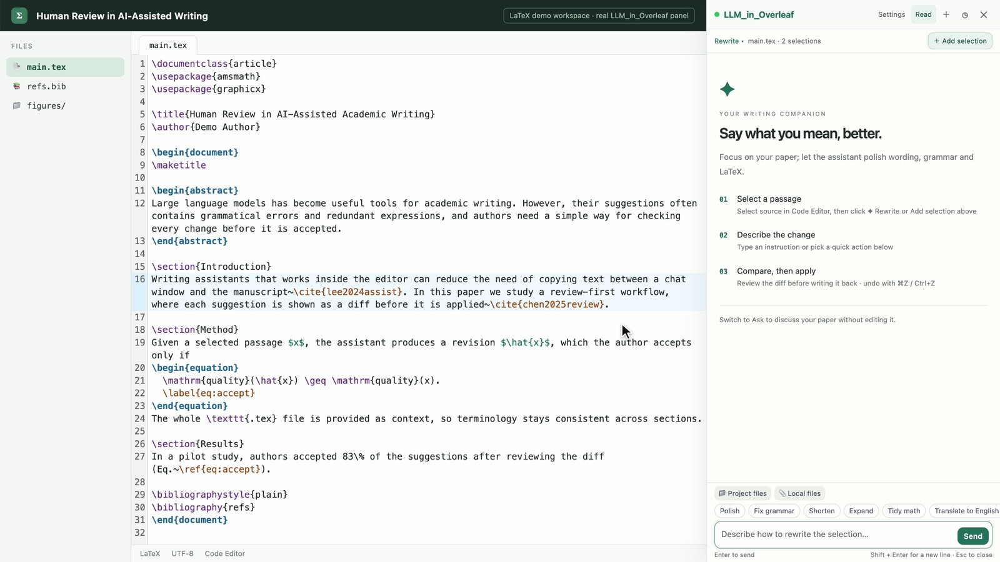
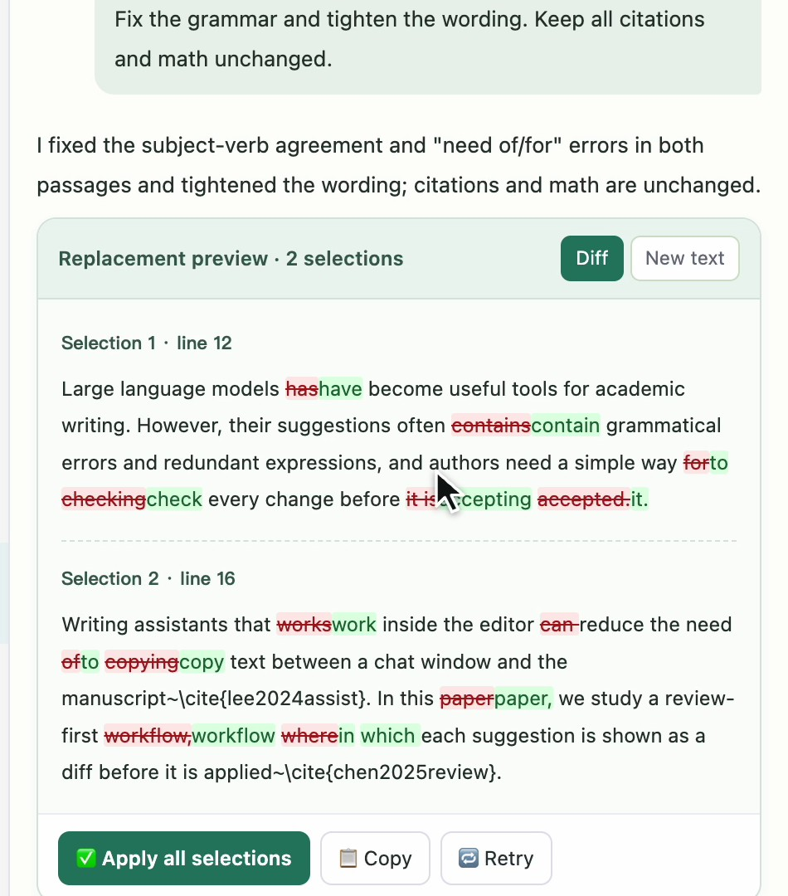
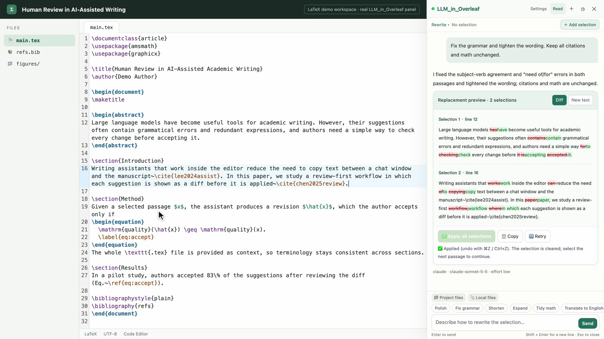
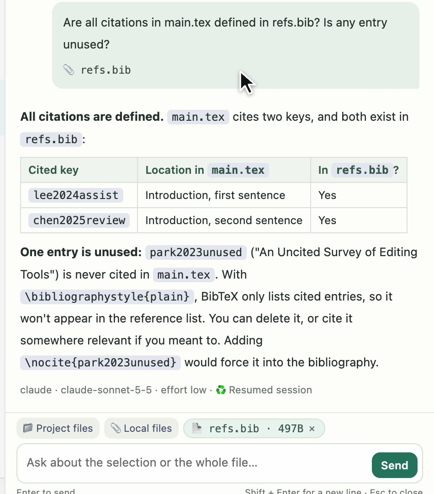

# LLM_in_Overleaf

[← LLM_in_Work](../README.md) · [LLM_in_Word](../LLM_in_Word/README.md) · [LLM_in_PowerPoint](../LLM_in_PowerPoint/README.md) · [LLM_in_Excel](../LLM_in_Excel/README.md)

**Review and apply AI edits right inside Overleaf's LaTeX editor.**

English · [简体中文](README.zh-CN.md)

Select one or more passages in a `.tex` file, give an instruction, review a diff for each passage, and apply them together. The extension calls the **Claude Code or Codex CLI** already signed in on your computer through the browser's Native Messaging. No API key, and no server to start yourself.

[Install](#install) · [First edit](#your-first-edit) · [Context and attachments](#context-and-attachments) · [Troubleshooting](#troubleshooting) · [Uninstall](#uninstall)



## Features

| Feature | What it does |
| --- | --- |
| LaTeX rewriting | Polish academic prose, fix grammar, shorten, expand, translate, or tidy math, with one click or your own words. |
| Multiple selections | Collect several non-adjacent passages from one source file and revise them with a single instruction. |
| Diff before applying | See additions and deletions for every passage, or switch to the new text. Nothing is written until you apply. |
| Checked write-back | The file name and original text are checked again before writing, so stale or misplaced edits are rejected. A group is applied as one editor step that a single **Cmd/Ctrl+Z** reverts. |
| Ask mode | Ask about the selection or the whole paper without replacing any text. |
| Attachments | Add other project files (`.bib`, chapters, `.cls`, `.sty`) or local text, images and PDFs as context. |
| Conversations | Keep refining, reopen per-project history, export Markdown, or start a fresh chat. |
| Backend controls | Switch between Claude and Codex, pick a model and a supported reasoning effort, check the connection, stop a request. |
| English and 中文 | The interface follows your browser language; switch any time in **Settings** or in the extension popup. Explanations follow the language of your instruction. |
| Reading view | Expand the reply area while keeping your draft. |

Works on `overleaf.com` and `cn.overleaf.com` in the **Code Editor** (not the Visual Editor or PDF preview). Installers support **macOS, Linux and Windows** and register the host for Chrome, Edge, Brave and Chromium (plus Arc and Vivaldi where available).

## See the workflow

**1. Collect passages.** Select LaTeX in the Code Editor and click the floating **✦ Rewrite** button. Keep adding separate passages with **＋ Add selection**.

**2. Review a diff for every passage.** The whole `.tex` file goes along as context, so citations, labels and math stay intact.



**3. Apply them together.** The extension checks the original text, writes both passages into the editor, and confirms. One undo reverts the whole group.



**4. Ask about the paper.** Attach `refs.bib` from the project and switch to **Ask** to check, for example, that every citation is defined.



The screenshots show the real extension and CodeMirror editor on a local demo page with sample text, not the hosted Overleaf website. Every answer came from Claude Code through this project's native host. [Screenshot notes](docs/images/README.md).

## Install

You need Node.js **22.12+ (22.x) or 24+** and at least one CLI installed and signed in: `claude auth login` or `codex login`.

**1. Register the native host** (no admin rights needed):

```bash
git clone https://github.com/ZJU-OmniAI/LLM_in_Work.git
cd LLM_in_Work/LLM_in_Overleaf
./install.sh                     # macOS and Linux
```

```powershell
# Windows (PowerShell), in LLM_in_Work\LLM_in_Overleaf
powershell.exe -NoProfile -ExecutionPolicy Bypass -File .\install.ps1
```

The installer records the current Node.js path, CLI overrides and proxy settings in a private launcher (`~/.llm_in_overleaf/host.sh`, or `%LOCALAPPDATA%\LLM_in_Overleaf\host.cmd` on Windows), registers the host with your browsers, then starts it once to check that it works and whether Claude Code and Codex are ready. The browser starts the host only when the panel needs it: there is no background service and no open port. Runtime use does not require `npm ci`.

**2. Load the extension.** Open `chrome://extensions` (or `edge://extensions`, `brave://extensions`), turn on **Developer mode**, click **Load unpacked**, and choose the **`LLM_in_Overleaf/extension`** folder. The extension ID is fixed, so the registration from step 1 matches it.

**3. Refresh Overleaf.** Open the extension popup: it should report the backend as ready.

Rerun the installer after moving this folder, reinstalling a CLI or changing proxy settings. To update: `git pull`, rerun the installer, click **Reload** on the extension card, then refresh Overleaf.

## Your first edit

1. Open a `.tex` file in Overleaf's **Code Editor** and select some source text.
2. Click **✦ Rewrite** next to the selection. You can also use the **Writing assistant** button at the bottom right, the popup's **Open writing assistant**, or **⌘⇧E** (Windows / Linux: **Ctrl+Shift+E**).
3. To edit more passages from the same file, select them and click **＋ Add selection**.
4. Type an instruction, for example *"Fix the grammar and tighten the wording. Keep all citations and math unchanged."*, or pick a quick action such as **Polish** or **Tidy math**.
5. Review the **Diff** (or **New text**). Send another message to refine it.
6. Click **Apply** on one passage, or **Apply all selections**. **Cmd+Z** / **Ctrl+Z** undoes the whole group.

After a successful apply, the selections are cleared and the conversation stays. To ask questions instead, click **Rewrite** at the top of the panel and choose **Ask**. **Read** enlarges the reply area; **Back** or Esc returns to your draft.

## Context and attachments

The first turn includes the whole current `.tex` file, not just the selection; very long files are trimmed around the preamble and your selections. Follow-ups reuse the CLI session and send only the new instruction, selections and attachments. After heavy manual editing, start a **New chat** (the **+** button) to reload the full file. Provider-side caching and pricing depend on your backend.

- **Project files** downloads the project source through Overleaf and lets you attach text files such as `.tex`, `.bib`, `.cls` and `.sty`.
- **Local files** attaches files from your computer: text, images and PDFs. PDF support is generally better with the Claude backend.
- Up to 8 attachments; images and PDFs up to 10 MB each and 25 MB in total. Binary files are written to a temporary folder for the request and removed afterwards.

Claude runs without your MCP servers or slash commands. Turns without attachments have no tools; turns with attachments may only **Read** those files. Codex runs in a read-only sandbox with approvals disabled.

Conversations are stored per Overleaf project in the extension's local storage, and the CLI may keep its own session history. The bridge is local, but inference normally runs at your provider. See [data and security](../SECURITY.md).

## Troubleshooting

| Symptom | What to check |
| --- | --- |
| No floating button | Make sure you are in the Code Editor. Open the panel from the bottom-right button or the popup, then click **＋ Add selection**. |
| "Native host not ready" | Run the installer from this folder and check the popup. Rerun it after moving the folder or reinstalling Node.js. |
| CLI not found / not signed in | Run `claude --version` or `codex --version` and log in from a terminal, then rerun the installer. Set `LLM_IN_OVERLEAF_CLAUDE_BIN` / `LLM_IN_OVERLEAF_CODEX_BIN` for custom locations. |
| Replacement rejected | The source changed since you selected it. Select the current text again. |
| Network or proxy errors | Check the CLI in a terminal; rerun the installer after changing proxy settings. |
| Request timed out | Lower the reasoning effort or select less text. The limit is 10 minutes (`LLM_IN_OVERLEAF_TIMEOUT_MS`). |
| Self-hosted Overleaf | Add your host to both `matches` lists in `extension/manifest.json` and to the project URL check in `background/service-worker.js`, then reload. Not supported by default. |

## Development

From `LLM_in_Overleaf/`:

```bash
npm ci
npm test                 # offline unit and regression tests, no model account needed
npm run test:ui          # real CodeMirror, synthetic pages and model replies (Chinese and English UI)
npm run test:ui:cn       # selection regressions on the cn.overleaf.com layout
npm run test:install     # installer smoke test in a temporary home folder
```

Set `CHROME_BIN` if Chrome is not in its standard location. UI tests never touch real Overleaf projects. Optional live tests use your model account and may consume quota: `npm run test:live`, `npm run test:live:codex`, and `npm run test:wrapper` (exercises the installed launcher).

Architecture: `extension/content/bridge.js` talks to CodeMirror in the page's MAIN world; `content.js` renders the panel; `background/service-worker.js` connects to `server/native-host.js`, which calls the selected CLI. Interface strings live in `extension/shared/i18n.js`.

## Uninstall

```bash
./install.sh --uninstall                                                            # macOS and Linux
powershell.exe -NoProfile -ExecutionPolicy Bypass -File .\install.ps1 -Uninstall   # Windows
```

This removes the host registrations and the launcher. Then remove the extension from your browser. Chat sessions created by the CLI stay in `~/.llm_in_overleaf` (Windows: `%LOCALAPPDATA%\LLM_in_Overleaf`) until you delete that folder.

[Changelog](CHANGELOG.md) · [Contributing](../CONTRIBUTING.md) · [MIT license](../LICENSE)
