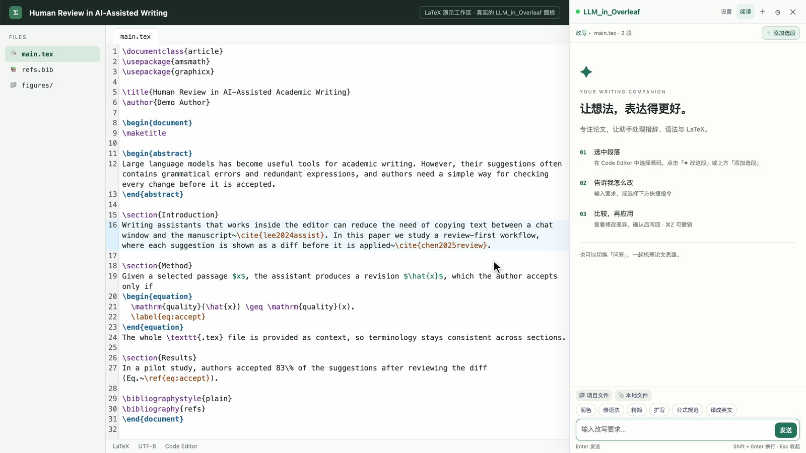
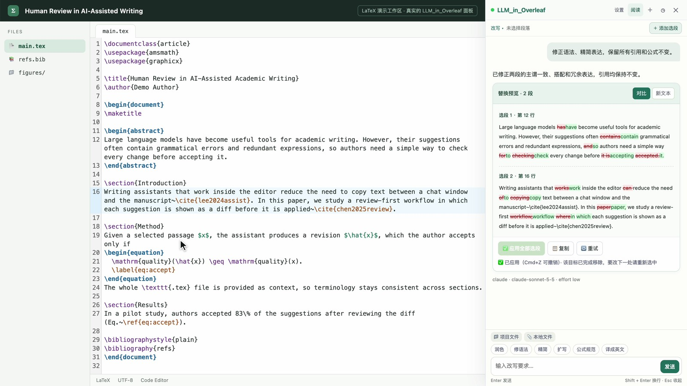

# LLM_in_Overleaf

[← LLM_in_Work 首页](../README.zh-CN.md) · [LLM_in_Word](../LLM_in_Word/README.zh-CN.md) · [LLM_in_PowerPoint](../LLM_in_PowerPoint/README.zh-CN.md) · [LLM_in_Excel](../LLM_in_Excel/README.zh-CN.md)

**把本机 Claude Code、Codex Agent 接入 Overleaf 工作流：在熟悉的软件中，精确选段、审阅差异、确认写回，也能直接问答。**

[English](README.md) · 简体中文

在 `.tex` 文件里选中一段或几段内容，输入修改要求，逐段查看差异，再一起应用。扩展通过浏览器的「原生消息」（Native Messaging）调用你电脑上已登录的 **Claude Code 或 Codex CLI**：不需要 API Key，也不用自己启动服务。

[安装](#安装) · [第一次修改](#第一次修改) · [上下文与附件](#上下文与附件) · [常见问题](#常见问题) · [卸载](#卸载)



## 可以做什么

| 功能 | 实际用途 |
| --- | --- |
| LaTeX 改写 | 学术润色、修语法、精简、扩写、翻译、公式规范；可以点快捷按钮，也可以自己写要求。 |
| 多个选段 | 把同一源码文件里不相邻的几段收集起来，用一条要求统一修改。 |
| 先看差异再应用 | 每段都能看到新增和删除，也可以切到「新文本」直接阅读。点应用之前不会写入。 |
| 写回前核对 | 写入前重新核对文件名和原文，内容已变或位置不对就拒绝写入。整组修改作为编辑器里的一步写入，**Cmd/Ctrl+Z** 一次就能撤销。 |
| 问答模式 | 围绕选段或整篇论文提问，不会替换任何内容。 |
| 附件 | 可以把项目里的其他文件（`.bib`、其他章节、`.cls`、`.sty`）或本地文本、图片、PDF 加进上下文。 |
| 多轮与历史 | 继续细化、按项目找回历史会话、导出 Markdown、开新会话。 |
| 后端设置 | 切换 Claude / Codex，选择模型和它支持的思考强度，检查连接，随时停止生成。 |
| 中英文界面 | 默认跟随浏览器语言；可在面板「设置」或扩展弹窗里随时切换。说明文字跟随你输入要求所用的语言。 |
| 阅读模式 | 放大回复区域，返回后输入草稿还在。 |

支持 `overleaf.com` 和 `cn.overleaf.com` 的 **Code Editor（源码编辑器）**，不支持可视化编辑器和 PDF 预览里的选区。安装脚本支持 **macOS、Linux 和 Windows**，会为 Chrome、Edge、Brave、Chromium（以及可用时的 Arc、Vivaldi）注册本机桥。

## 使用流程

**1. 收集选段。** 在 Code Editor 里选中 LaTeX，点浮出的 **✦ 改这段**；还要改别的段落，就选中后点 **＋ 添加选段**。

**2. 逐段查看差异。** 整个 `.tex` 文件会作为上下文一起发送，引用、标签和公式都能保持不变。


**3. 一起应用。** 扩展先核对原文，再把两段一起写进编辑器并提示成功；撤销一次就能还原整组修改。



**4. 围绕论文提问。** 从项目里加上 `refs.bib`，切换到「问答」模式，比如检查引用是否都有定义。


截图来自本地演示页面里运行的真实扩展和 CodeMirror 编辑器，文稿是专门编写的示例，不是 Overleaf 官网截图；所有回答都由 Claude Code 经本项目的本机桥实际生成。[截图说明](docs/images/README.md)。

[Chrome 商店发布材料与流程](../docs/chrome-store/README.zh-CN.md) · [隐私政策](../docs/chrome-store/PRIVACY.md#中文)

## 安装

准备 Node.js **22.12+（22.x）或 24+**，并至少安装、登录一个命令行工具：`claude auth login` 或 `codex login`。

**1. 注册本机桥**（不需要管理员权限）：

```bash
git clone https://github.com/ZJU-OmniAI/LLM_in_Work.git
cd LLM_in_Work/LLM_in_Overleaf
./install.sh                     # macOS 和 Linux
```

```powershell
# Windows（PowerShell），在 LLM_in_Work\LLM_in_Overleaf 目录下
powershell.exe -NoProfile -ExecutionPolicy Bypass -File .\install.ps1
```

安装脚本会把当前的 Node.js 路径、CLI 路径设置和代理设置写进一个只有你能读的启动脚本（`~/.llm_in_overleaf/host.sh`；Windows 为 `%LOCALAPPDATA%\LLM_in_Overleaf\host.cmd`），为浏览器注册本机桥，然后试启动一次，检查它能否正常工作、Claude Code 和 Codex 是否就绪。之后只有面板需要时浏览器才会启动本机桥：没有常驻后台，也不占用端口。日常使用不需要 `npm ci`。

**2. 加载扩展。** 打开 `chrome://extensions`（或 `edge://extensions`、`brave://extensions`），开启 **开发者模式**，点 **加载已解压的扩展程序**，选择 **`LLM_in_Overleaf/extension`** 文件夹。扩展 ID 是固定的，与第 1 步的注册自动对应。

**3. 刷新 Overleaf。** 打开扩展弹窗，看到后端「已就绪」即可。

移动了项目文件夹、重装了命令行工具或改了代理设置后，重新运行一次安装脚本。更新方法：`git pull`，重新运行安装脚本，在扩展页点 **重新加载**，再刷新 Overleaf。

## 第一次修改

1. 在 Overleaf 的 **Code Editor** 里打开 `.tex` 文件，选中一段源码。
2. 点选区旁的 **✦ 改这段**。也可以点右下角的 **✦ 写作助手**、扩展弹窗里的 **打开写作助手**，或按 **⌘⇧E**（Windows / Linux：**Ctrl+Shift+E**）。
3. 要同时修改同一文件里的其他段落，选中后点 **＋ 添加选段**。
4. 输入要求，例如「修正语法、精简表达，保留所有引用和公式不变。」，或者直接点 **润色**、**公式规范** 等快捷按钮。
5. 查看 **对比**（或 **新文本**），不满意就继续发消息细化。
6. 点单段的 **应用替换**，或 **应用全部选段**。**Cmd+Z** / **Ctrl+Z** 可撤销整组修改。

应用成功后，选段会自动清空，对话保留。想提问而不改文，点面板顶部的 **改写**，切换到 **问答**。**阅读** 可放大回复区域，点 **返回** 或按 Esc 回到草稿。

## 上下文与附件

第一轮会发送整个当前 `.tex` 文件，而不只是选区；文件特别长时，会保留导言区和选段附近的内容。后续对话复用 CLI 会话，只发送新的要求、选段和附件。手动改动较多之后，点 **开新会话**（**+** 按钮）重新读取全文。服务商侧的缓存和计费取决于你用的后端。

- **项目文件**：通过 Overleaf 下载项目源码，可把 `.tex`、`.bib`、`.cls`、`.sty` 等文本文件加进上下文。
- **本地文件**：从电脑添加文本、图片和 PDF。PDF 通常用 Claude 后端效果更好。
- 最多 8 个附件；图片和 PDF 每个不超过 10 MB，合计不超过 25 MB。二进制文件只在请求期间写入临时文件夹，结束后删除。

调用 Claude 时不加载你本机的 MCP 服务和斜杠命令；不带附件时不开放任何工具，带附件时只允许**读取**这些附件。Codex 在只读沙箱中运行，并关闭审批。

会话按 Overleaf 项目保存在扩展的本地存储里，CLI 也可能保留自己的会话记录。本机桥在你电脑上运行，但模型推理通常在服务商那边进行。详见[安全与数据说明](../SECURITY.md)。

## 常见问题

| 现象 | 检查什么 |
| --- | --- |
| 没有浮出按钮 | 确认在 Code Editor 里。从右下角按钮或扩展弹窗打开面板，再点 **＋ 添加选段**。 |
| 提示「本机桥未就绪」 | 在本目录重新运行安装脚本，并查看扩展弹窗。移动文件夹或重装 Node.js 后都要重跑。 |
| 找不到 CLI / 未登录 | 在终端运行 `claude --version` 或 `codex --version` 并完成登录，再重跑安装脚本。自定义位置可设置 `LLM_IN_OVERLEAF_CLAUDE_BIN` / `LLM_IN_OVERLEAF_CODEX_BIN`。 |
| 替换被拒绝 | 选中之后源码又变了。重新选中当前内容即可。 |
| 网络或代理报错 | 先在终端里确认 CLI 能用；改了代理设置后重跑安装脚本。 |
| 请求超时 | 降低思考强度或少选一些内容。时限为 10 分钟（`LLM_IN_OVERLEAF_TIMEOUT_MS`）。 |
| 自建 Overleaf | 需要把你的域名加进 `extension/manifest.json` 的两处 `matches`，以及 `background/service-worker.js` 的项目地址检查，然后重新加载。默认不支持。 |

## 开发

在 `LLM_in_Overleaf/` 目录下：

```bash
npm ci
npm test                 # 离线单元与回归测试，不需要模型账号
npm run test:ui          # 真实 CodeMirror + 合成页面和模型回复（中文、英文界面）
npm run test:ui:cn       # cn.overleaf.com 布局下的选区回归测试
npm run test:install     # 在临时主目录里跑安装脚本冒烟测试
```

Chrome 不在默认位置时设置 `CHROME_BIN`。界面测试不会碰真实的 Overleaf 项目。可选的在线测试会使用你的模型账号并消耗额度：`npm run test:live`、`npm run test:live:codex`、`npm run test:wrapper`（测试已安装的启动脚本）。

结构：`extension/content/bridge.js` 在页面主环境里连接 CodeMirror；`content.js` 负责面板；`background/service-worker.js` 连接 `server/native-host.js`，由它调用所选的 CLI。界面文字集中在 `extension/shared/i18n.js`。

## 卸载

```bash
./install.sh --uninstall                                                            # macOS 和 Linux
powershell.exe -NoProfile -ExecutionPolicy Bypass -File .\install.ps1 -Uninstall   # Windows
```

这会删除本机桥注册和启动脚本；然后在浏览器里移除扩展。CLI 生成的会话记录保存在 `~/.llm_in_overleaf`（Windows：`%LOCALAPPDATA%\LLM_in_Overleaf`），不再需要时手动删除该文件夹。

[更新记录](CHANGELOG.md) · [参与开发](../CONTRIBUTING.md) · [MIT 许可证](../LICENSE)
