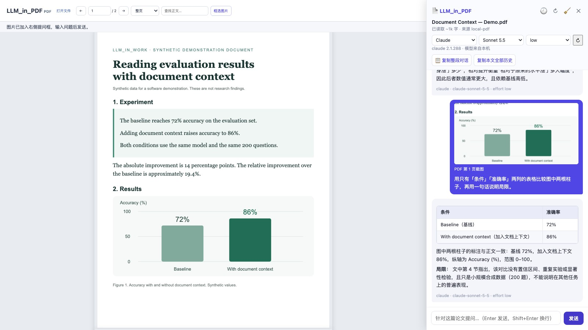

# LLM_in_PDF

**Connect your local Claude Code or Codex to PDFs in Chrome: select text or a figure and ask beside the document.**

**English** · [简体中文](README.zh-CN.md) · [LLM_in_Work](../README.md)

Previously `paper_read`, now part of LLM_in_Work. This Chrome extension brings your signed-in local agent into the PDF workflow already in your browser, for online/local PDFs and paper webpages. Select the exact passage or crop a figure and ask about it alongside the document. PDFs remain unchanged. The interface is currently Chinese; questions and answers can be English or Chinese.



[Chrome Web Store publishing kit](../docs/chrome-store/README.zh-CN.md) · [Privacy policy](../docs/chrome-store/PRIVACY.md)

## Install

You need **Node.js 22.13+** and a signed-in Claude Code or Codex CLI. No separate API key is required.

On **macOS or Linux**, from this repository:

```bash
cd LLM_in_PDF
./install.sh
```

Then open `chrome://extensions`, enable **Developer mode**, choose **Load unpacked** and select `LLM_in_PDF/extension`. Chrome, Chromium, Edge and Brave use the same extension. Native Messaging starts the bridge on demand; no service needs to stay running.

On **Windows**, native installation is not yet provided. Run `npm start` in this directory, keep the terminal open, and load the extension as above. The extension falls back to the loopback HTTP service at `http://localhost:8765`. This mode also works on macOS/Linux.

The extension bundles PDF.js, Markdown-it and KaTeX. Installing from this checkout does not require an npm build or an npm install for normal use.

## Read and ask

| Source | How to open |
| --- | --- |
| arXiv | Open an abstract, HTML or PDF page; the panel/PDF view opens automatically. |
| Online PDF | Open its URL. PDF responses are detected even without a `.pdf` suffix. |
| Publisher page | Click the extension, then **打开当前 PDF / 论文的 PDF 链接** to discover a PDF link, or **读取当前论文网页** to read the current page. |
| Local PDF | Choose **选择 / 拖入本地 PDF** and import a file (up to 100 MB). |
| `file://` PDF | Enable **Allow access to file URLs** in extension settings; import does not need this permission. |

The extension’s in-browser PDF view preserves PDF layout, extracts the text layer, and supports zoom, page navigation and search. Select text, click **问一下**, and send a question. For figures, charts or scans, choose **框选图片**, drag a rectangle on one page, and ask about the actual pixels. Up to four recent images accompany each request. Scanned PDFs support image questions but do not gain automatic full-document OCR.

Use the backend, model and effort menus to choose Claude/Codex. Model lists come from the installed CLIs, including each Codex model's supported reasoning levels. Replies stream with Markdown tables, code and LaTeX formulas.

History is saved per document. Online documents use their source URL; local documents use their content fingerprint, so renamed copies share history and different files with the same name do not. Clear a conversation to archive it (up to ten archives per document). Copy the current conversation or all history as Markdown. Imported files persist locally across refreshes and can be removed independently of conversations.

PDF responses marked as attachments still download. For login-protected or blocked documents, download from the original site and import the file. This extension does not bypass access controls.

## Migrate from paper_read

Run `./install.sh` from the new directory, then load/reload the new `extension/` path using the **same extension ID**. Do not uninstall the old extension first: uninstalling can erase browser storage.

The public manifest key, extension ID, history keys, document fingerprints and `com.paper_read.host` Native Messaging name are deliberately retained. The installer points that registration at the new checkout through `~/.llm_in_pdf/host.sh`. Existing `~/.paper_read` files are left in place.

Settings use the `LLM_IN_PDF_*` prefix; legacy `PAPER_READ_*` names remain aliases, with the new name taking priority. Examples: `LLM_IN_PDF_PORT`, `LLM_IN_PDF_CLAUDE_BIN`, `LLM_IN_PDF_CODEX_BIN`, `LLM_IN_PDF_TIMEOUT_MS`.

Re-run the installer after moving this directory, changing Node, or changing proxy settings. Proxy values are saved in the local launcher without being printed. To uninstall the native bridge, run `./install.sh --uninstall`.

## Data and architecture

```text
Chrome paper page / PDF view (PDF.js) → extension background → Native Messaging host → Claude Code / Codex CLI
                                                  ↘ HTTP fallback (127.0.0.1:8765)
```

The original imported PDF stays in browser storage. When you send a question, extracted text (up to 600,000 characters), conversation history, selected text and recent screenshots are sent through your signed-in CLI to its model provider. This is not offline inference. Local files and chat history remain in browser storage; model providers and CLIs have their own data policies.

Claude tools and MCP servers are disabled. Codex uses a read-only sandbox with approvals disabled; local Codex configuration may still load tools. Temporary image files are cleaned after completion or cancellation. The HTTP fallback accepts this extension's origin and listens only on loopback. See [Security and data](../SECURITY.md).

## Development and verification

```bash
npm ci
npm run vendor                 # refresh bundled third-party files and licenses
npm test                       # offline CLIs, protocols, Markdown, sources, installer
npx playwright-core install chromium
npm run test:ui                # real extension + synthetic PDF + mock replies
npm run test:install            # isolated macOS/Linux installation lifecycle
npm run test:live               # optional real Claude + public arXiv smoke test
npm run test:live:codex         # optional real Codex smoke test
```

Live checks require signed-in CLIs and consume account usage. Browser regressions use temporary profiles and do not access personal documents or existing browser history.

Source: `extension/` (MV3 PDF view, panel and background), `server/` (native and HTTP bridges, CLI adapters), `tests/`, `tools/` (installer and vendoring).

## License

Project code is [MIT](../LICENSE). Bundled PDF.js is Apache-2.0; Markdown-it and KaTeX are MIT, with licenses preserved under `extension/vendor/`. The manifest contains only the public key needed for a stable extension ID; no private signing key is included or required.
