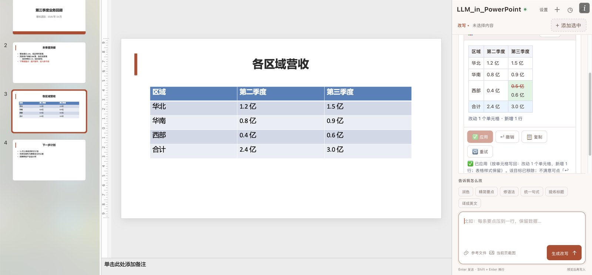
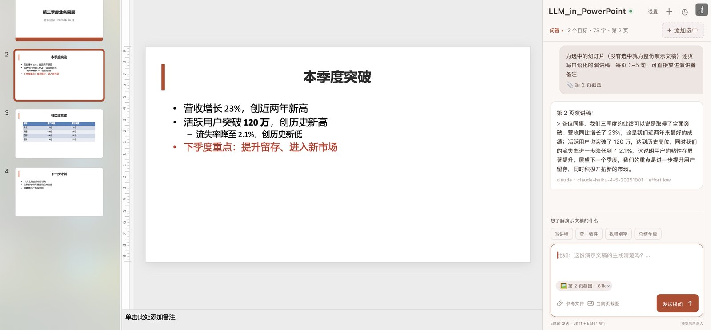

# LLM_in_PowerPoint

[← LLM_in_Work](../README.zh-CN.md) · [LLM_in_Word](../LLM_in_Word/README.zh-CN.md) · [LLM_in_Overleaf](../LLM_in_Overleaf/README.zh-CN.md)

**把本机的 Claude Code 或 Codex CLI 装进 Microsoft PowerPoint。**

[English](README.md) · 简体中文

选中幻灯片里的文字、文本框、表格或整页，说出想怎么改，预览差异后一键应用。只改动有变化的字词，所以加粗的数字、颜色、要点层级和段内换行都保持原样。LLM_in_PowerPoint 把这套流程放进 PowerPoint 的侧边栏，直接沿用你本机 CLI 的登录状态。

[Windows 安装](#windows-安装) · [macOS 安装](#macos-安装) · [第一次改写](#第一次改写) · [故障排查](docs/troubleshooting.md) · [参与贡献](CONTRIBUTING.md)


*macOS 上真实的桌面版 PowerPoint 与 LLM_in_PowerPoint 侧栏，演示文稿为截图专门编写。*

## 能做什么

| 功能 | 具体用法 |
| --- | --- |
| 改写幻灯片文字 | 精简要点、提炼标题、修语法、统一句式，或者整页翻译。 |
| 按习惯选目标 | 可以添加选中的几个字、整个文本框、表格、一组文本框，或者当前页的全部文字；一次最多 **16** 处，可以跨页。 |
| 先预览再应用 | 每个目标一张差异卡片：红色是删除，绿色是新增。点「应用」之前幻灯片不会有任何变化。 |
| 保留原有格式 | 只改动有变化的字词。没改的文字保持原来的字体、字号、颜色和加粗；新写的字沿用周围文字的格式；要点保持原来的缩进层级。 |
| 一键撤销 | 应用后的卡片上有「↩ 撤销」：恢复原来的文字，并把目标放回列表，方便换个说法再改。 |
| 改表格 | 改单元格、增加行、删除行；只写回有变化的单元格，表格样式不变。 |
| 让模型看到这一页 | 「当前页截图」把当前页渲染成图片附上，模型能据此判断版式和文字是否放得下。 |
| 对整份演示文稿提问 | 「演示文稿问答」可以写讲稿、查术语和数字是否前后一致、找错别字、总结全篇，回答会注明页码。 |
| 连续对话 | 在同一个会话里继续细化；输入草稿会保留；可以查看本机历史、把会话导出为 Markdown。 |
| 切换界面语言 | 随时切换 English / 中文，不用重开面板；说明文字跟随你指令的语言。 |
| 选择写作引擎 | 在 Claude Code 和 Codex 之间切换，选择模型和它支持的思考强度。 |

## 在 PowerPoint 里的流程

**1. 添加目标并描述修改。** 选中几个字、一个文本框或一张表格，点「＋ 添加选中」。什么都不选时，「＋ 添加选中」会添加当前页的全部文本框。然后为所有目标输入一条指令。

**2. 逐个预览。** 每个目标一张差异卡片，标明所在页码和类型（标题、正文、文本框、表格）。应用之前幻灯片不会变化。

**3. 应用。** 点卡片上的「应用」或「应用全部」。只写入变化的字词：下图里改写后的要点仍保留加粗的数字，二级要点仍是二级缩进，红色的要点仍是红色。


**4. 改表格。** 选中表格添加为目标。有变化的单元格会显示划掉的旧值，新增的行会高亮；应用时只写这些单元格和行。



**5. 对整份演示文稿提问。** 点「改写 ▾」切换到「演示文稿问答」。需要看版式时附上「当前页截图」。预设按钮可以写讲稿、查一致性、找错别字、总结全篇。



截图来自 macOS 上真实的桌面版 PowerPoint（16.109），演示文稿为演示专门编写；所有回复均由 Claude Code（Haiku 4.5，思考强度 low）生成。[截图说明](docs/images/README.md)。

## 平台支持

| 平台 | 安装与运行 | 验证情况 |
| --- | --- | --- |
| **macOS 桌面版 PowerPoint** | Shell 安装脚本；已装 LLM_in_Word 时沿用它已信任的证书，否则加入钥匙串信任；launchd 常驻服务；侧载到 PowerPoint | 离线测试（用模拟的 PowerPoint 跑完整流程），并在真实 PowerPoint 16.109 里跑通文字、分组、表格、当前页截图和撤销。 |
| **Windows 桌面版 PowerPoint** | 原生 PowerShell 安装脚本；当前用户证书信任；注册到 PowerPoint；后台服务和登录自启 | Windows CI 覆盖安装、更新、重启、HTTPS 和卸载；Windows 上的真实 PowerPoint 交互仍需实机验收。 |
| 网页版 / 移动版 PowerPoint | 没有可用的安装方式 | 本版本不支持。 |
| Linux | 后端开发和浏览器预览 | 只有离线测试。 |

请使用较新的 **Microsoft 365 桌面版 PowerPoint**。清单要求 PowerPointApi 1.5（2022 年以后的 PowerPoint）；表格、分组形状和当前页截图需要 PowerPointApi 1.8；表格增删行需要 1.9。面板启动时会检查，版本不支持的功能会自动禁用。

## 安装前准备

需要：

1. **Node.js 22.12+（22.x）或 24+**，从 [Node.js 官网](https://nodejs.org/en/download) 安装。
2. **Git**，或者下载并解压本仓库的 ZIP。
3. 至少一个已登录的本机 CLI：[Claude Code](https://code.claude.com/docs/en/setup) 或 [Codex CLI](https://github.com/openai/codex)。

在运行 PowerPoint 的同一个系统用户下，打开终端检查要用的 CLI：

```text
node --version
claude --version
claude auth login
```

Codex 用户运行 `codex --version` 和 `codex login`。两个后端装一个就够。Windows 上请使用**原生 Windows 版 CLI**，只装在 WSL 里的不行。

## Windows 安装

```powershell
git clone https://github.com/ZJU-OmniAI/LLM_in_Work.git
cd LLM_in_Work/LLM_in_PowerPoint
powershell.exe -NoProfile -ExecutionPolicy Bypass -File .\install.ps1
```

`Bypass` 只对这一次 PowerShell 进程生效。Windows 可能会弹窗让你确认信任本机证书。安装脚本会：把运行文件拷到 `%LOCALAPPDATA%\LLM_in_PowerPoint\app`；只在**当前用户**范围内信任证书；把 `manifest.xml` 注册为开发者加载项；在 `127.0.0.1:8387` 启动隐藏的后台服务，并添加当前用户的登录启动项；最后通过 HTTPS 检查服务。

完全关闭并重新打开 PowerPoint，从「开始 → 加载项 → 开发人员加载项 → LLM_in_PowerPoint」打开（部分版本在「插入 → 我的加载项」）。加载一次之后，「开始」功能区会出现 **LLM_in_PowerPoint** 按钮。

## macOS 安装

```bash
git clone https://github.com/ZJU-OmniAI/LLM_in_Work.git
cd LLM_in_Work/LLM_in_PowerPoint
./install.sh
```

安装脚本会把运行文件拷到 `~/.llm_in_powerpoint/app`，注册 launchd 服务 `com.llm_in_powerpoint.server`（端口 8387），并把清单放进 PowerPoint 的侧载目录。**如果已经装了 LLM_in_Word，会直接沿用它已信任的本机证书，不会再次要求输入密码**（证书只绑定 `localhost`，与端口无关）；否则第一次安装会弹一次密码框，用来信任新生成的证书。

按 **Cmd+Q** 完全退出 PowerPoint 再重新打开，点「开始」功能区里的 **LLM_in_PowerPoint**。没有按钮的话，先从「插入 → 加载项 → 我的加载项 → 开发人员加载项 → LLM_in_PowerPoint」打开一次。参见[微软的 Mac 侧载说明](https://learn.microsoft.com/zh-cn/office/dev/add-ins/testing/sideload-an-office-add-in-on-mac)。

LLM_in_Word（端口 8377）和 LLM_in_PowerPoint（端口 8387）是两个独立的服务，可以同时运行。

## 第一次改写

1. 打开一份演示文稿的副本，打开 **LLM_in_PowerPoint** 侧栏。
2. 点「设置」，按需选择界面语言、**Claude Code** 或 **Codex** 以及模型。标题旁的小圆点表示连接状态；需要登录或找不到 CLI 时，点「设置」里的状态行查看处理方法。
3. 选中要改的内容：几个字、一个文本框、一张表格，或者什么都不选（表示当前整页）。点「＋ 添加选中」，需要的话再从其他页添加。「设置」里会列出所有目标和所在页码，可以定位（📍）或移除。
4. 输入指令，比如「**每条要点压到一行，保留数字**」，或者点一个预设，比如「精简要点」。
5. 点「生成改写」。回复会实时显示，随时可以停止。
6. 看差异，点「应用」（或「应用全部」）。
7. 检查幻灯片。不满意就点卡片上的「↩ 撤销」：恢复原来的文字，并把目标放回列表。

想了解整份演示文稿，点顶部的「改写 ▾」切换到「演示文稿问答」，回答会注明页码。PowerPoint 的加载项接口读不到演讲者备注，所以「写讲稿」会把讲稿写在对话里，由你粘贴到备注栏。

## 应用是怎么做的

每个目标记住它所在的页、形状，以及字符位置和原文。写入前面板会重新读取幻灯片：原文挪了位置就重新找到它；发送后又被手动改过就先让你确认；原文找不到了就不写入。

新旧文字按词（中文按字）对比，只替换有变化的片段，从文本末尾往前写。PowerPoint 会保留没改动字符的格式；替换进去的字沿用被替换的第一个字的格式，插入的字沿用左边文字的格式。新的一行会成为同一层级的新要点；要点内部的换行（Shift+Enter）仍然是换行。写完后回读核对。表格按行对比：先按内容把新旧行对齐，只写有变化的单元格，新增的行插到对应位置。

## 模型会收到什么？

**只选了一条要点，不代表模型只看到这一条。** 目标决定可以写入的位置；首次请求或幻灯片有变化时，整份演示文稿的文字会作为上下文发给所选的 CLI：按页列出，每个文本框标明类型（标题、正文、文本框、表格），不包含演讲者备注。很长的演示文稿会保留目标所在页及附近的页，总共约 11 万字符。只有你主动附上「当前页截图」时才会发送图片。

后端在本机运行、只监听 `127.0.0.1:8387`，但模型推理通常会连接你所选的服务商；你的 CLI 登录、服务商设置、账户额度和计费照常适用，CLI 的历史记录也可能保存提示词和幻灯片文字。处理机密演示文稿前，请先阅读[数据与安全说明](SECURITY.md)。

## 更新与管理服务

```text
git pull --ff-only
npm run update
```

然后在面板里点 ⟳。清单有变化时需要完全重启 PowerPoint。

macOS 重启服务：`launchctl kickstart -k gui/$(id -u)/com.llm_in_powerpoint.server`（日志 `~/.llm_in_powerpoint/server.log`）。
Windows：`powershell.exe -NoProfile -ExecutionPolicy Bypass -File .\tools\windows-service.ps1 -Action Restart`（日志 `%LOCALAPPDATA%\LLM_in_PowerPoint\server.log`）。

## 配置

安装脚本会把这些设置写进后台服务；要修改的话，先设好环境变量再运行 `npm run update`。

| 环境变量 | 作用 | 默认值 |
| --- | --- | --- |
| `LLM_IN_POWERPOINT_CLAUDE_BIN` | Claude 可执行文件或 JS 入口 | 自动查找 |
| `LLM_IN_POWERPOINT_CODEX_BIN` | Codex 可执行文件或 JS 入口 | 自动查找 |
| `LLM_IN_POWERPOINT_TIMEOUT_MS` | 单次 CLI 请求的总时限 | `300000` |
| `LLM_IN_POWERPOINT_MAX_CHARS` | 服务端对演示文稿文字的上限 | `120000` |
| `LLM_IN_POWERPOINT_DATA_DIR` | 直接运行服务时的数据目录 | `~/.llm_in_powerpoint` |
| `LLM_IN_POWERPOINT_PORT` | 直接运行服务时的端口 | `8387` |

修改安装后的端口，还要同步修改 `manifest.xml` 里所有 localhost 地址。请让系统代理绕过 `localhost`、`127.0.0.1` 和 `::1`。

## 开发与测试

```text
npm ci
npm test
npm run preview
```

`npm test` 运行离线测试：改动规划、演示文稿上下文、面板在模拟 PowerPoint 上的完整流程（`tools/fixtures/fake-powerpoint.js`，复现了在真实 PowerPoint 里观察到的行为）、界面、翻译、提示词，以及用模拟 CLI 测后端。浏览器预览地址是 `http://127.0.0.1:8389/taskpane.html`；读写幻灯片需要真实的加载项。可选的在线测试（`npm run test:live`、`npm run test:live:codex`）会消耗服务商额度。

另见[技术说明](docs/architecture.md)、[参与贡献](CONTRIBUTING.md)和[更新记录](CHANGELOG.md)。

## 已知限制

- SmartArt、图表，以及母版和版式里的文字，加载项接口改不了。
- 加载项读不到演讲者备注；问答可以帮你写好讲稿再手动粘贴。
- 表格暂时不能增删列；含合并单元格的表格不能作为目标。
- 文字变长很多时可能溢出文本框（PowerPoint 的自动调整照常生效）；应用后请逐页检查。
- 模型可能出错，数字和人名请自己核对。

## 卸载

macOS：`./install.sh --uninstall`（或 `npm run uninstall`）。会停止服务并移除清单；`~/.llm_in_powerpoint` 里的本机数据和钥匙串里的证书（可能与 LLM_in_Word 共用）会保留。

Windows：`powershell.exe -NoProfile -ExecutionPolicy Bypass -File .\tools\windows-service.ps1 -Action Uninstall`。会停止服务、移除登录启动项和 PowerPoint 注册，并从当前用户证书库删除这次安装的证书；不再需要时手动删除 `%LOCALAPPDATA%\LLM_in_PowerPoint`。

## 许可证

[MIT](../LICENSE)。Office.js、模型 CLI 及其服务分别适用各自的许可和条款。LLM_in_PowerPoint 是 ZJU-OmniAI 的独立项目，不是微软、Anthropic 或 OpenAI 的官方产品。
