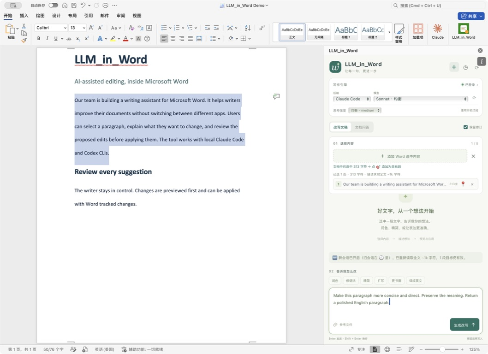
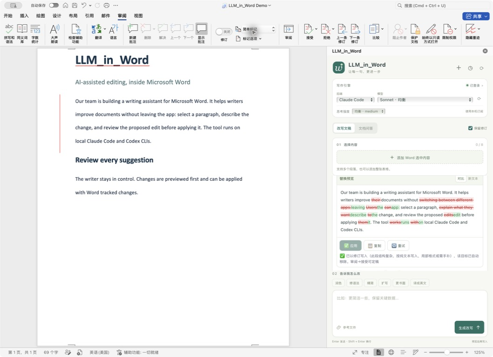

# LLM_in_Word

[← LLM_in_Work 首页](../README.zh-CN.md) · [LLM_in_Overleaf](../LLM_in_Overleaf/README.zh-CN.md)

**把本机 Claude Code 与 Codex CLI，带进 Microsoft Word。**

[English](README.md) · 简体中文

选中正文，描述修改要求，查看差异，再通过 Word 修订写入。LLM_in_Word 把这套流程放进 Word 侧栏，沿用你已经登录的本机 CLI，无需在文档与聊天窗口之间来回复制。

[Windows 安装](#windows-安装) · [macOS 安装](#macos-安装) · [第一次改写](#第一次改写) · [故障排查](docs/troubleshooting.md) · [参与贡献](CONTRIBUTING.md)



*截图来自 macOS 桌面版 Word，使用专门编写的英文演示文案。*

## 可以做什么

| 功能 | 实际用途 |
| --- | --- |
| 选区改写 | 润色论文、压缩段落、翻译、调整语气、修改语法。 |
| 先看差异，再应用 | 在侧栏查看新增和删除内容；点击应用前，不会把生成结果写入正文。 |
| 保留 Word 修订 | 启用「保留修订」，在 Word「审阅」中逐条接受或拒绝改动。 |
| 多目标统一修改 | 最多添加 **8 个**不连续的段落或表格，用一条指令统一修改。 |
| 表格编辑 | 改写单元格、预览表格差异，也可将选中的文本转换为表格。 |
| 文档问答 | 总结全文、解释概念、查找前后矛盾，无需替换正文。 |
| 多轮交流 | 继续细化结果，保留输入草稿，查看本地历史，导出 Markdown 会话。 |
| 界面语言切换 | 无需重启，即可在 English 和中文之间切换。 |
| 双后端切换 | 使用 Claude Code 或 Codex，选择模型及其支持的思考强度。 |
| 参考文件 | 附加 TXT、Markdown、CSV、PDF 或图片；具体读取能力取决于后端和模型。 |
| 连接检测与恢复 | 查看 CLI 路径、版本、登录状态，停止生成或重试失败请求。 |

侧栏支持 **简体中文和英文**。通过顶部的 **English / 中文** 下拉框可立即切换并记住选择；首次使用优先采用可用的 Word 显示语言，取不到时跟随浏览器语言，其他语言默认使用英文。切换时保留草稿、附件、目标和已有回复，不翻译文档原文或历史模型回复。生成过程中暂时禁用语言切换。仓库首页默认显示英文，可通过顶部链接切换中文。

## 在 Word 里实际使用

**先预览差异。** 左侧仍是 Word 中选中的原段落，右侧显示新增和删除内容。本例使用真实 Claude Code 返回的改写结果。


**再以修订写入。** 新段落已进入文档；Word「简单标记」视图中的左侧红线表示存在待处理修订，可以通过「审阅」接受或拒绝。本例触发了纯文本回退，侧栏会明确提示格式可能需要检查。



三张截图均来自同一份 macOS Word 演示文档，用于展示工作流，不代表 Windows 实机截图。[截图说明](docs/images/README.md)。

## 平台支持

| 平台 | 安装与运行 | 验证范围 |
| --- | --- | --- |
| **Windows 桌面版 Word** | 原生 PowerShell 安装、用户级证书信任、Word 注册、后台运行和登录自启 | Windows CI 检查后端及安装、更新、重启、HTTPS、卸载；仍需 Windows Word 真机交互验收。 |
| **macOS 桌面版 Word** | Shell 安装、钥匙串信任、launchd 常驻、加载项侧载 | 后端测试及真实 Word 工作流验证；下方截图来自 macOS Word。 |
| Word 网页版 / 移动版 | 尚无支持的安装流程 | 本版本不支持。 |
| Linux | 可开发后端、预览网页界面 | 运行离线测试，无桌面 Word 安装器。 |

建议使用较新的 **Microsoft 365 桌面版 Word**，并启用 Office 网页加载项。清单要求 WordApi 1.3，部分功能需要更新的 Word API。旧版永久授权 Office、WPS 和 LibreOffice 不在当前验证范围。单位设备可能由管理员禁止侧载或本机证书信任。

## 安装前准备

1. 安装 [Node.js](https://nodejs.org/en/download)：22.x 需 **22.12 及以上**，或使用 **24 及以上**。
2. 安装 Git，或下载并解压项目 ZIP。仓库现已公开，下载源码无需登录 GitHub。
3. 安装并登录至少一个后端：[Claude Code 安装说明](https://code.claude.com/docs/en/setup) / [Codex CLI](https://github.com/openai/codex)。

在运行 Word 的同一系统、同一用户下打开终端，检查你准备使用的后端：

```text
node --version
claude --version
claude auth login
```

如果使用 Codex：

```text
codex --version
codex login
```

**不需要两个后端都安装。** Windows 请安装原生 Windows CLI，仅安装在 WSL 内的 CLI 不能直接供本安装器使用。支持原生 `.exe` 和官方 npm 安装产生的 `.cmd` 入口。安装器不会替你安装或登录模型 CLI。

模型下拉框会显示本机 Claude Code CLI 解析的版本（例如 **Opus 5**），下方同时显示完整模型 ID。Sonnet、Opus、Haiku 仍是自动别名，版本会随 CLI 或账号配置变化。刷新列表只读取 CLI 能力目录，不发送生成请求或文档内容。每次 Claude 回复还会记录该次调用实际报告的模型；旧版 CLI 无法提供版本时，会明确显示「自动版本」。

## Windows 安装

目标环境：Windows 11、较新的 Microsoft 365 桌面版 Word、Windows PowerShell 5.1 或以上。使用平时运行 Word 的普通用户执行；安装器不要求管理员权限。单位管理的电脑请遵守单位的加载项策略。

```powershell
git clone https://github.com/ZJU-OmniAI/LLM_in_Work.git
cd LLM_in_Work/LLM_in_Word
powershell.exe -NoProfile -ExecutionPolicy Bypass -File .\install.ps1
```

这里的 `Bypass` 只作用于本次 PowerShell 进程，不会修改系统执行策略。运行前可以先查看脚本。Windows 可能提示确认信任生成的 localhost 证书。

安装器会依次：

1. 将运行文件复制到 `%LOCALAPPDATA%\LLM_in_Word\app`，并限制本地数据目录的访问权限。
2. 创建仅用于 localhost 的 HTTPS 证书，导入**当前用户**证书存储并信任。
3. 按[微软开发工具的注册方式](https://github.com/OfficeDev/Office-Addin-Scripts/blob/master/packages/office-addin-dev-settings/src/dev-settings-windows.ts)，将清单登记到当前用户的 Word 开发人员加载项注册表。
4. 保存 CLI 路径与代理环境变量，不在控制台打印凭证。
5. 启动隐藏的后台守护进程，创建**当前用户的启动文件夹快捷方式**，下次登录自动运行。
6. 使用刚生成的证书验证 HTTPS 服务是否正常。运行时不需要安装额外 npm 依赖。

完全关闭并重新打开 Word，在 **开始 → 加载项 → 开发人员加载项 → LLM_in_Word** 中打开。不同 Office 版本可能显示在 **插入 → 我的加载项**，或 **更多加载项 → 我的加载项**。加载后，「开始」功能区会出现 **LLM_in_Word** 按钮。

如果下载了 ZIP，先解压，再在项目目录执行上述 PowerShell 安装命令。仅使用加载项不需要执行 `npm ci`。

## macOS 安装

```bash
git clone https://github.com/ZJU-OmniAI/LLM_in_Work.git
cd LLM_in_Work/LLM_in_Word
./install.sh
```

安装器会将运行代码复制到 `~/.llm_in_word/app`，创建 localhost HTTPS 证书，注册用户级 `com.llm_in_word.server` launchd 服务，并把清单放进 Word 侧载目录。首次信任证书可能需要输入 Mac 登录密码。

用 **Cmd+Q** 完全退出 Word 后重新打开，在 **开始 → 加载项 → 开发人员加载项** 中选择 **LLM_in_Word**。旧版 Word 的入口可能位于「插入 → 我的加载项」。另见[微软 Mac 侧载说明](https://learn.microsoft.com/en-us/office/dev/add-ins/testing/sideload-an-office-add-in-on-mac)。

**从 word_edit 升级：** 安装器会保留现有 `~/.word_edit` 数据目录与证书，替换旧 launchd 服务并清理旧清单文件名。已有文档目标锚点及本地会话存储继续兼容。项目显示名称为 `LLM_in_Word`；为符合 npm 命名规则，包名使用 `llm-in-word`。

## 第一次改写

1. 打开一份用于试用的 Word 文档副本，并打开 **LLM_in_Word** 侧栏。
2. 选择 **Claude Code** 或 **Codex**；连接状态异常时，点击状态按钮查看登录与路径指引。
3. 在正文中选中一段，点击 **添加 Word 选中内容**。需要一起修改其他段落时，依次选中并添加。
4. 输入要求，例如：**“压缩到原长度的三分之二，保留所有数字和结论，语气更正式。”**
5. 点击 **生成改写**，等待流式输出；需要中止时点击 **停止生成**。
6. 检查差异，保持 **保留修订** 勾选，再点击结果卡片上的应用按钮。
7. 在 Word 中查看实际改动，通过「审阅」逐条接受或拒绝。

想要提问时，切换至 **文档问答**，例如输入“总结全文的三个主要观点”。想继续修改，就在同一会话补充要求。文档或目标发生变化时，工具会重新构建上下文，避免沿用过时内容。

| 需求 | 示例指令 |
| --- | --- |
| 英文润色 | Improve the academic tone. Preserve every number and citation. |
| 精简中文 | 删除重复表达，控制在 150 字以内，不增加新事实。 |
| 统一多段术语 | 将这些段落中的术语统一，保留各段的论证重点。 |
| 修改表格 | 统一第二列的表述风格，保留所有数值。 |
| 文档问答 | 找出前后结论不一致的地方，并说明原因。 |

## 模型究竟会读到哪些内容？

**选中一段，不代表模型只读这一段。** 选区决定允许写回的位置；首轮请求或上下文变化时，工具还会把文档正文作为背景交给所选 CLI。超长文档在侧栏约 110,000 字符处围绕目标截断，服务端默认上限为 120,000 字符。可兼容的后续对话会复用 CLI 会话。

后端服务运行在本机 `127.0.0.1:8377`，但模型推理通常会连接相应服务商，**并非完全离线**。账户认证、代理、模型配置、额度与费用沿用 CLI 的设置。附件交给所选后端处理；CLI 历史记录也可能保留提示和文档内容。侧栏历史保存在 Word 网页视图的本地存储中。处理敏感文档前请阅读[数据与安全说明](SECURITY.md)。

## 更新与服务管理

Windows 和 macOS 均可在项目源码目录运行：

```text
git pull --ff-only
npm run update
```

安装器会备份旧运行目录。更新后刷新侧栏；如果清单有变，需要完全重启 Word。CLI 路径或代理变化后，应重新执行安装或更新。

Windows 查看状态、重启、停止：

```powershell
powershell.exe -NoProfile -ExecutionPolicy Bypass -File .\tools\windows-service.ps1 -Action Status
powershell.exe -NoProfile -ExecutionPolicy Bypass -File .\tools\windows-service.ps1 -Action Restart
powershell.exe -NoProfile -ExecutionPolicy Bypass -File .\tools\windows-service.ps1 -Action Stop
```

macOS 重启：

```bash
launchctl kickstart -k gui/$(id -u)/com.llm_in_word.server
```

连接设置面板会显示日志路径。Windows 默认是 `%LOCALAPPDATA%\LLM_in_Word\server.log`；Mac 新安装默认是 `~/.llm_in_word/server.log`，旧版升级沿用 `~/.word_edit/server.log`。

## 配置

直接运行 `node server/server.js` 时可使用环境变量。安装器会保存本次安装时的 CLI 路径覆盖、代理、超时及正文上限；Windows 存在受访问权限保护的 `runtime.json`，macOS 存在 `run.sh` 中。

| 环境变量 | 用途 | 默认值 |
| --- | --- | --- |
| `LLM_IN_WORD_CLAUDE_BIN` | Claude 可执行文件或 JS 入口 | 自动发现 |
| `LLM_IN_WORD_CODEX_BIN` | Codex 可执行文件或 JS 入口 | 自动发现 |
| `LLM_IN_WORD_TIMEOUT_MS` | 单次 CLI 总超时，毫秒 | `300000` |
| `LLM_IN_WORD_MAX_CHARS` | 服务端正文字符上限 | `120000` |
| `LLM_IN_WORD_DATA_DIR` | 直接启动时的数据目录 | `~/.llm_in_word`，或现有 `~/.word_edit` |
| `LLM_IN_WORD_CERT_DIR` | HTTPS 证书目录 | `<数据目录>/cert` |
| `LLM_IN_WORD_PORT` | 直接启动时的端口 | `8377` |

旧的 `WORD_EDIT_*` 变量仍作为回退别名。安装器采用固定的平台目录及 8377 端口；改变已安装服务的端口，还需要同步修改 `manifest.xml` 中所有 localhost 地址。系统代理应绕过 `localhost`、`127.0.0.1` 和 `::1`。

## 开发与验证

```text
npm ci
npm test
npm run preview
```

浏览器预览地址为 `http://127.0.0.1:8380/taskpane.html`。普通浏览器可以预览侧栏、检查后端连接；读取和写入 Word 文档必须在真实加载项中完成。

离线回归测试采用合成文本和模拟 CLI，不需要模型账号。[GitHub Actions](https://github.com/ZJU-OmniAI/LLM_in_Work/actions) 在 Linux、macOS 和 Windows 上运行这些测试。Windows 还验证安装及服务生命周期和本机 HTTPS。无桌面的 CI 会跳过需要人工点击的 Windows 证书信任弹窗，改为显式使用生成的证书验证 HTTPS；CI **不包含 Word 桌面应用及证书弹窗的交互验证**。

可选的真实后端测试会消耗模型额度：

```text
npm run test:live
npm run test:live:codex
```

另见[架构说明](docs/architecture.md)、[贡献指南](CONTRIBUTING.md)、[更新记录](CHANGELOG.md)。

## 已知限制

- 格式迁移尽力保留原样；复杂结构、图片及不支持的 HTML 可能回退为纯文本替换。应用后请检查格式。
- 模型可能出错，事实、公式、表格和引用需要人工核对。
- Word API 与单位策略各不相同。Windows 支持代码已实现，Windows Word 交互仍待真机验收。
- 本工具面向单用户本机使用，不适合作为共享网络或公网服务部署。

## 卸载

Windows：

```powershell
powershell.exe -NoProfile -ExecutionPolicy Bypass -File .\tools\windows-service.ps1 -Action Uninstall
```

这会停止进程树、移除启动快捷方式和 Word 注册，并从当前用户证书库移除本次安装的证书。`%LOCALAPPDATA%\LLM_in_Word` 下的文件和日志保留；不再需要时可手动删除目录。

macOS：

```bash
launchctl bootout gui/$(id -u)/com.llm_in_word.server
rm -f ~/Library/LaunchAgents/com.llm_in_word.server.plist
rm -f ~/Library/Containers/com.microsoft.Word/Data/Documents/wef/LLM_in_Word-manifest.xml
```

随后在「钥匙串访问」中移除 `LLM_in_Word-localhost` 证书（旧版名称为 `word_edit-localhost`），并按需删除运行目录。CLI 保存的会话与 Word 网页视图中的历史独立存在，不会随运行目录一起自动清除。

## 许可证

[MIT](../LICENSE)。Office.js、模型 CLI 及服务继续遵守其各自的许可证与条款。本项目由 ZJU-OmniAI 独立维护，并非 Microsoft、Anthropic 或 OpenAI 的官方产品。
