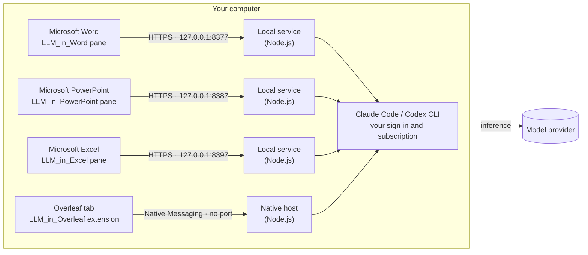

<div align="center">

# LLM_in_Work

**Your local Claude Code and Codex, inside Microsoft Word, PowerPoint, Excel and Overleaf.**

Select text, describe the change, review the diff, apply. No copying between a chat window and your document, and no extra API key.

[](https://github.com/ZJU-OmniAI/LLM_in_Work/actions/workflows/ci.yml)
[](LICENSE)
[](LLM_in_Word/README.md)
[](LLM_in_PowerPoint/README.md)
[](LLM_in_Excel/README.md)
[](LLM_in_Overleaf/README.md)
[](#quick-start)

**English** · [简体中文](README.zh-CN.md)

</div>

https://github.com/user-attachments/assets/f6d255d1-0f46-4867-aaf6-50513a279c16

<p align="center"><sub>Real recordings, English narration, bilingual subtitles · <a href="README.zh-CN.md">中文配音版</a> · <a href="https://github.com/ZJU-OmniAI/LLM_in_Work/releases/tag/2026-09-30">Download 1080p + subtitles</a></sub></p>

## Why LLM_in_Work

- **No API key, no new account.** It drives the Claude Code or Codex CLI already signed in on your computer, so it uses the subscription you already have.
- **Review before anything changes.** Every edit arrives as a diff (red for deletions, green for additions). Your document stays untouched until you click Apply.
- **Native write-back.** Word receives real tracked changes that you accept or reject in the Review tab. PowerPoint rewrites only the changed words, so fonts, colours and bullet levels stay. Excel writes only the cells that change, as if typed, so number formats stay and IDs like `00123` stay text. Both have a one-click Undo. Overleaf applies a whole group of edits as one step that a single undo reverts.
- **Several passages, one instruction.** Up to eight paragraphs or whole tables in Word; up to sixteen text boxes, tables or whole slides in PowerPoint; up to eight cell ranges in Excel, including empty columns to fill; several separate selections in one `.tex` file in Overleaf.
- **Whole-document context.** The full document, the whole deck, the workbook's sheets or the `.tex` file goes along with your request, so terminology, citations and math stay consistent. Add `.bib` files, other chapters or PDFs when you need more.
- **Careful by design.** The original text is checked again before writing, so an edit never lands in the wrong place. Table and spreadsheet edits touch only the rows and cells that changed. CLI calls run without your MCP servers and without extra tools.
- **Ask, not only edit.** Document Q&A in Word, Presentation Q&A in PowerPoint (speaker notes, consistency checks, with an image of the slide if you like), Workbook Q&A in Excel (summaries, outliers, formula explanations, with cell addresses) and Ask mode in Overleaf answer questions without changing your text.
- **English and 中文.** Switch the interface at any time. Explanations follow the language of your instruction.

## Four assistants, one workflow

| | [LLM_in_Word](LLM_in_Word/README.md) | [LLM_in_PowerPoint](LLM_in_PowerPoint/README.md) | [LLM_in_Excel](LLM_in_Excel/README.md) | [LLM_in_Overleaf](LLM_in_Overleaf/README.md) |
| --- | --- | --- | --- | --- |
| Works in | Microsoft Word desktop | Microsoft PowerPoint desktop | Microsoft Excel desktop | Overleaf's Code Editor (`overleaf.com`, `cn.overleaf.com`) |
| Review | Text and table diffs, applied as Word tracked changes | A diff per target; only changed words are written, with one-click Undo | A cell preview per range; only changed cells are written, with one-click Undo | A LaTeX diff for every selection, applied as one undoable step |
| Edit together | Up to 8 paragraphs or tables | Up to 16 text boxes, tables or whole slides, across slides | Up to 8 ranges (4,000 cells), including empty columns to fill | Several non-adjacent selections in one `.tex` file |
| Ask questions | Document Q&A about the whole document | Presentation Q&A, optionally with an image of the slide | Workbook Q&A with cell addresses | Ask mode with the `.tex` file and attached project files |
| Runs on | Windows and macOS | Windows and macOS | Windows and macOS | Chrome, Edge, Brave and other Chromium browsers on Windows, macOS and Linux |
| Connection | Office add-in → local HTTPS service (`127.0.0.1:8377`) → CLI | Office add-in → local HTTPS service (`127.0.0.1:8387`) → CLI | Office add-in → local HTTPS service (`127.0.0.1:8397`) → CLI | Extension → Native Messaging (no port) → CLI |
| Interface | English · 中文 | English · 中文 | English · 中文 | English · 中文 |

## See it in action

<table>
  <tr>
    <td width="50%"></td>
    <td width="50%"></td>
  </tr>
  <tr>
    <td><b>Word:</b> every target gets its own diff. Apply one, or all at once.</td>
    <td><b>Overleaf:</b> citations and math stay intact; each selection has its own diff.</td>
  </tr>
  <tr>
    <td></td>
    <td></td>
  </tr>
  <tr>
    <td><b>Tables:</b> a new row is inserted on its own; every other cell stays as it was.</td>
    <td><b>Ask mode:</b> attach <code>refs.bib</code> and check that every citation is defined.</td>
  </tr>
  <tr>
    <td></td>
    <td></td>
  </tr>
  <tr>
    <td><b>PowerPoint:</b> add a whole slide; the title and the bullets each get a diff.</td>
    <td><b>Applied:</b> only changed words are rewritten, so bold figures, indent levels and colours stay.</td>
  </tr>
  <tr>
    <td></td>
    <td></td>
  </tr>
  <tr>
    <td><b>Excel:</b> clean up names and regions; the preview strikes through each old value.</td>
    <td><b>Fill a column:</b> categories written from the feedback in each row, formatting untouched.</td>
  </tr>
</table>

Word and Overleaf screenshots come from the demo recordings: real desktop Word on macOS, and the real extension and CodeMirror editor on a local demo page (not the hosted Overleaf site), with answers from Claude Code (Sonnet 5.5, low effort). PowerPoint and Excel screenshots are from real desktop PowerPoint and Excel on macOS, with answers from Claude Code (Haiku 4.5, low effort). The demo video covers Word and Overleaf.

## How it works



All four bridges run locally and add no cloud service of their own. The model itself runs wherever your CLI sends it, usually the provider's service.

## Quick start

**You need:** Node.js 22.12+ (22.x) or 24+, and at least one CLI installed and signed in: [Claude Code](https://code.claude.com/docs/en/setup) (`claude auth login`) or [Codex CLI](https://github.com/openai/codex) (`codex login`).

```bash
git clone https://github.com/ZJU-OmniAI/LLM_in_Work.git
cd LLM_in_Work
```

| | LLM_in_Word | LLM_in_PowerPoint | LLM_in_Excel | LLM_in_Overleaf |
| --- | --- | --- | --- | --- |
| macOS | `cd LLM_in_Word && ./install.sh` | `cd LLM_in_PowerPoint && ./install.sh` | `cd LLM_in_Excel && ./install.sh` | `cd LLM_in_Overleaf && ./install.sh` |
| Linux | Not available (no desktop Word) | Not available (no desktop PowerPoint) | Not available (no desktop Excel) | `cd LLM_in_Overleaf && ./install.sh` |
| Windows | In `LLM_in_Word`: `powershell.exe -NoProfile -ExecutionPolicy Bypass -File .\install.ps1` | The same command in `LLM_in_PowerPoint` | The same command in `LLM_in_Excel` | The same command in `LLM_in_Overleaf` |
| Then | Restart Word, then **Home → Add-ins → Developer Add-ins → LLM_in_Word** | Restart PowerPoint, then **Home → LLM_in_PowerPoint** (or **Developer Add-ins**) | Restart Excel, then **Home → LLM_in_Excel** (or **Developer Add-ins**) | Open `chrome://extensions`, turn on **Developer mode**, **Load unpacked** → `LLM_in_Overleaf/extension` |

Install any of them. On macOS, LLM_in_PowerPoint and LLM_in_Excel reuse the trusted local certificate of an Office assistant installed before them (PowerPoint reuses Word's; Excel reuses Word's or PowerPoint's), so installing Word first means your password is asked only once. Step-by-step guides with screenshots: **[LLM_in_Word](LLM_in_Word/README.md)** · **[LLM_in_PowerPoint](LLM_in_PowerPoint/README.md)** · **[LLM_in_Excel](LLM_in_Excel/README.md)** · **[LLM_in_Overleaf](LLM_in_Overleaf/README.md)**.

## FAQ

**Do I need an API key?**
No. Requests go through your signed-in Claude Code or Codex CLI and count against that account's plan or usage.

**What does the model receive?**
Your instruction, the selected passages, the document (Word), the text of the whole deck (PowerPoint), the workbook's sheets (Excel) or the current `.tex` file (Overleaf) as context, and any files you attach. Selecting a passage limits where edits are written, not what is sent. Read [data and security](SECURITY.md) before using confidential documents.

**Can it change my document without asking?**
No. Results are previews until you click Apply. In Word you can still reject each tracked change; in PowerPoint and Excel each applied card has an Undo button; in Overleaf one undo reverts the whole group.

**Which editors are supported?**
Microsoft 365 desktop Word, PowerPoint and Excel on Windows and macOS, and the Code Editor on `overleaf.com` and `cn.overleaf.com`. Office for the web, the Overleaf visual editor and self-hosted Overleaf are not supported out of the box.

**Is this an official Microsoft, Overleaf, Anthropic or OpenAI product?**
No. It is an independent open-source project by ZJU-OmniAI.

## Repository

```text
LLM_in_Work/
├── LLM_in_Word/       Word add-in, local HTTPS service, installers
├── LLM_in_PowerPoint/ PowerPoint add-in, local HTTPS service, installers
├── LLM_in_Excel/      Excel add-in, local HTTPS service, installers
├── LLM_in_Overleaf/   Browser extension, native messaging host, installers
├── SECURITY.md        What is sent where, and how the CLIs are called
└── CONTRIBUTING.md    Tests and CI for all projects
```

All projects run without npm runtime dependencies. Offline tests use mock CLIs and synthetic documents, and [CI](https://github.com/ZJU-OmniAI/LLM_in_Work/actions) runs them on Linux, macOS and Windows. See [Contributing](CONTRIBUTING.md) and the [changelog](CHANGELOG.md).

## License

[MIT](LICENSE). Office.js, Overleaf, the model CLIs and their services remain subject to their own terms.
