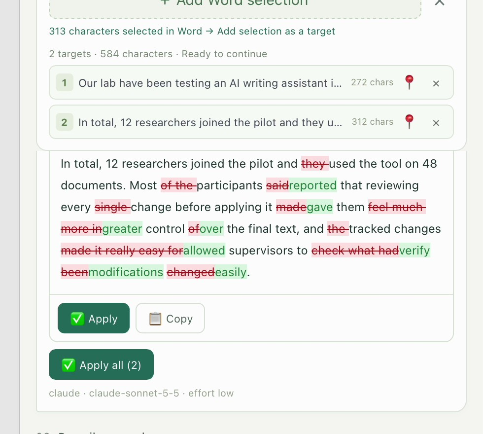
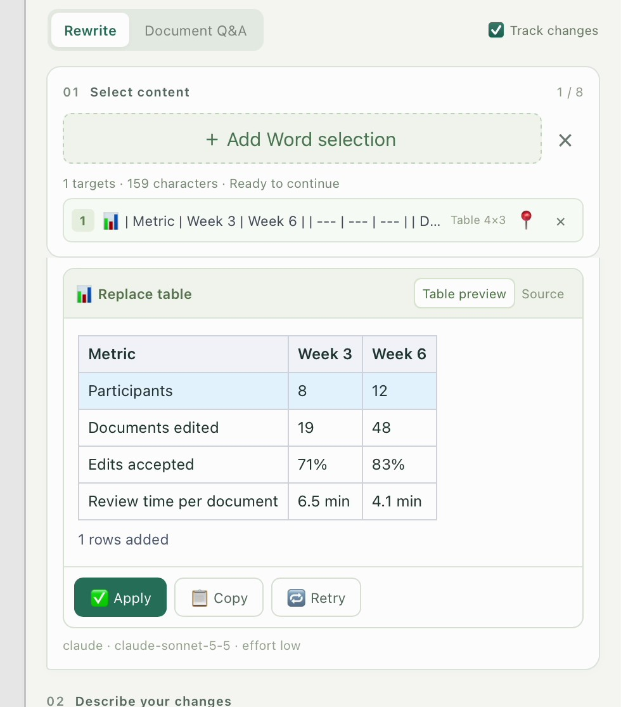
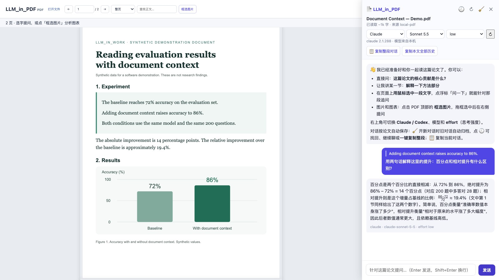
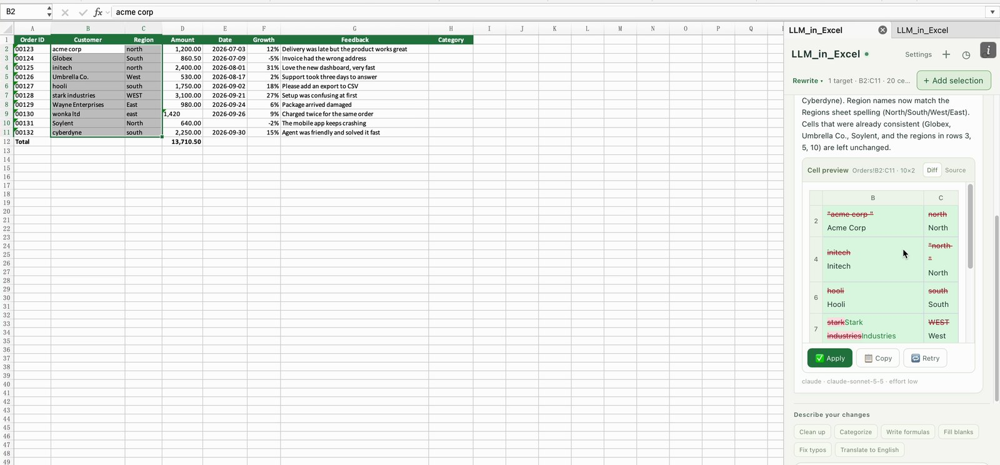
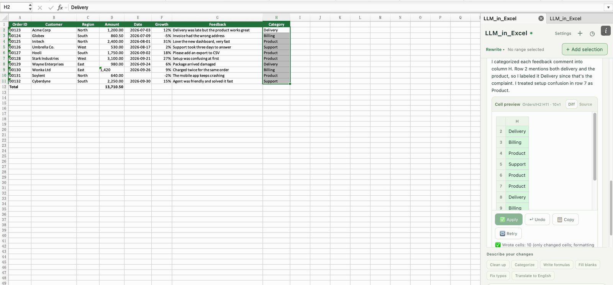
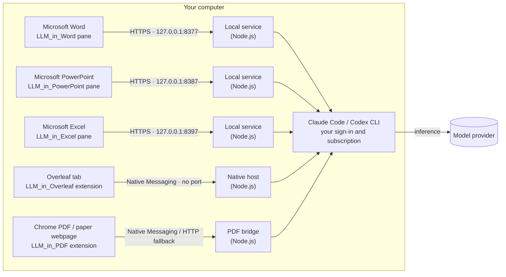

<div align="center">

# LLM_in_Work

**Your local Claude Code or Codex, inside Word, Overleaf, PDFs in Chrome, PowerPoint and Excel.**

Select exactly what you mean. Review each proposed edit. Confirm it in the app where you work.

[](https://github.com/ZJU-OmniAI/LLM_in_Work/actions/workflows/ci.yml)
[](LICENSE)
[](LLM_in_Word/README.md)
[](LLM_in_Overleaf/README.md)
[](LLM_in_PDF/README.md)
[](LLM_in_PowerPoint/README.md)
[](LLM_in_Excel/README.md)
[](#quick-start)

**English** · [简体中文](README.zh-CN.md)

</div>

## Why we built this

Claude Code and Codex can already edit Word documents, revise slides and read PDFs. The missing part of a separate agent window is direct control inside the app: pointing to the exact passage, figure or local detail you are looking at, reviewing the proposed change there, and deciding what to apply.

**LLM_in_Work connects the agents already installed and signed in on your computer to your everyday software.** Select a passage in Word or Overleaf, text or a figure in a PDF in Chrome, a target on a PowerPoint slide, or a range in Excel. Keep working in the same place: select, request, review and confirm. Editing assistants apply changes only after your confirmation; PDF questions leave the original document unchanged.

**60-second intro · English narration**

https://github.com/user-attachments/assets/3180e9f8-1c2e-4a95-9eb9-462a146fd208

<p align="center"><sub>Your local agent, wired into your work: precise, scoped, in your control · <a href="README.zh-CN.md">中文配音版</a> · <a href="https://github.com/ZJU-OmniAI/LLM_in_Work/releases/tag/2026-10-08-intro">Download 1080p + subtitles</a></sub></p>

**Demo order: Word → Overleaf → Chrome PDF → PowerPoint → Excel.**

**Watch the full story demo (3 min) · English narration**

https://github.com/user-attachments/assets/b44d0ada-1b19-463f-98a0-4123b95bac15

<p align="center"><sub>Real recordings, a story opening, warm narration and bilingual subtitles · <a href="README.zh-CN.md">中文配音版</a> · <a href="https://github.com/ZJU-OmniAI/LLM_in_Work/releases/tag/2026-10-08-story">Download 1080p + subtitles</a></sub></p>

## What you can do

- **No API key, no new account.** It drives the Claude Code or Codex CLI already signed in on your computer, so it uses the subscription you already have.
- **Review before anything changes.** Every edit arrives as a diff (red for deletions, green for additions). Your document stays untouched until you click Apply.
- **Native write-back.** Word receives real tracked changes that you accept or reject in the Review tab. Overleaf applies a whole group of edits as one step that a single undo reverts. PowerPoint rewrites only the changed words, so fonts, colours and bullet levels stay. Excel writes only the cells that change, as if typed, so number formats stay and IDs like `00123` stay text. PowerPoint and Excel both have a one-click Undo.
- **Several passages, one instruction.** Up to eight paragraphs or whole tables in Word; several separate selections in one `.tex` file in Overleaf; up to sixteen text boxes, tables or whole slides in PowerPoint; up to eight cell ranges in Excel, including empty columns to fill.
- **Whole-document context.** The full document, the whole deck, the workbook's sheets or the `.tex` file goes along with your request, so terminology, citations and math stay consistent. Add `.bib` files, other chapters or PDFs when you need more.
- **Careful by design.** The original text is checked again before writing, so an edit never lands in the wrong place. Table and spreadsheet edits touch only the rows and cells that changed. Claude calls disable your MCP servers and restrict tools; Codex uses a read-only sandbox. See the security notes for details.
- **Formatting and slide redesign in PowerPoint.** Format mode changes how a slide looks, not its words: from “make this black border lighter” to “polish this whole slide”, which splits crowded bullets into cards, lines up fonts, sizes and colours, and separates text from pictures. Big changes are checked once from a new image of the slide, and Undo puts the whole slide back.
- **Ask, not only edit.** Document Q&A in Word, Ask mode in Overleaf, PDF questions in Chrome, Presentation Q&A in PowerPoint (speaker notes, consistency checks, with an image of the slide if you like) and Workbook Q&A in Excel (summaries, outliers, formula explanations, with cell addresses) answer questions without changing your text.
- **Read papers interactively and ask about selected content in Chrome.** LLM_in_PDF helps you read local PDFs and papers from arXiv and other platforms with your local Claude Code or Codex agent. Select a passage or crop a figure for explanations, summaries, translations and follow-up questions. Markdown, formulas, per-document history and conversation export are built in. PDFs stay unchanged.
- **English and 中文.** The four editing assistants have switchable interfaces. The PDF interface is currently Chinese and supports English/Chinese questions and answers.

## Five assistants for writing and reading

|  | [LLM_in_Word](LLM_in_Word/README.md) | [LLM_in_Overleaf](LLM_in_Overleaf/README.md) | [LLM_in_PDF](LLM_in_PDF/README.md) | [LLM_in_PowerPoint](LLM_in_PowerPoint/README.md) | [LLM_in_Excel](LLM_in_Excel/README.md) |
| --- | --- | --- | --- | --- | --- |
| Works in | Microsoft Word desktop | Overleaf's Code Editor (`overleaf.com`, `cn.overleaf.com`) | PDFs and paper webpages in Chrome / Chromium | Microsoft PowerPoint desktop | Microsoft Excel desktop |
| Review | Text and table diffs, applied as Word tracked changes | A LaTeX diff for every selection, applied as one undoable step | Read-only Q&A; preserves the original PDF | A diff per target; only changed words are written, with one-click Undo | A cell preview per range; only changed cells are written, with one-click Undo |
| Edit together | Up to 8 paragraphs or tables | Several non-adjacent selections in one `.tex` file | Select text or attach up to 4 recent figure crops | Up to 16 text boxes, tables or whole slides, across slides | Up to 8 ranges (4,000 cells), including empty columns to fill |
| Formatting | — | — | PDF.js layout, Markdown tables and KaTeX formulas | Format mode: borders, fills, fonts, alignment, tables, background, and whole-slide redesign with cards; one-click Undo | — |
| Ask questions | Document Q&A about the whole document | Ask mode with the `.tex` file and attached project files | Full text, selected passages and actual figure pixels | Presentation Q&A, optionally with an image of the slide | Workbook Q&A with cell addresses |
| Runs on | Windows and macOS | Chrome, Edge, Brave and other Chromium browsers on Windows, macOS and Linux | macOS/Linux native bridge; Windows HTTP fallback | Windows and macOS | Windows and macOS |
| Connection | Office add-in → local HTTPS service (`127.0.0.1:8377`) → CLI | Extension → Native Messaging (no port) → CLI | Extension → Native Messaging; optional loopback HTTP (`8765`) | Office add-in → local HTTPS service (`127.0.0.1:8387`) → CLI | Office add-in → local HTTPS service (`127.0.0.1:8397`) → CLI |
| Interface | English · 中文 | English · 中文 | 中文 UI; English/中文 Q&A | English · 中文 | English · 中文 |

## See it in action

<table>
  <tr>
    <td width="50%"></td>
    <td width="50%"></td>
  </tr>
  <tr>
    <td><b>Word:</b> every target gets its own diff. Apply one, or all at once.</td>
    <td><b>Overleaf:</b> citations and math stay intact; each selection has its own diff.</td>
  </tr>
  <tr>
    <td></td>
    <td></td>
  </tr>
  <tr>
    <td><b>Tables:</b> a new row is inserted on its own; every other cell stays as it was.</td>
    <td><b>Ask mode:</b> attach <code>refs.bib</code> and check that every citation is defined.</td>
  </tr>
  <tr>
    <td></td>
    <td></td>
  </tr>
  <tr>
    <td><b>Chrome PDF:</b> select a passage and ask with the full document as context.</td>
    <td><b>Figures:</b> crop the chart and ask about the actual pixels.</td>
  </tr>
  <tr>
    <td></td>
    <td></td>
  </tr>
  <tr>
    <td><b>PowerPoint:</b> add a whole slide; the title and the bullets each get a diff.</td>
    <td><b>Applied:</b> only changed words are rewritten, so bold figures, indent levels and colours stay.</td>
  </tr>
  <tr>
    <td></td>
    <td></td>
  </tr>
  <tr>
    <td><b>Excel:</b> clean up names and regions; the preview strikes through each old value.</td>
    <td><b>Fill a column:</b> categories written from the feedback in each row, formatting untouched.</td>
  </tr>
</table>

Screenshots come from real apps on macOS: desktop Word, PowerPoint and Excel, and for Overleaf the real extension and CodeMirror editor on a local demo page (not the hosted Overleaf site). The Word, Excel and Overleaf images are frames from the demo recordings, with answers from Claude Code (Sonnet 5.5, low effort); the PowerPoint images were taken separately, with answers from Claude Code (Haiku 4.5, low effort). The updated video covers all five assistants; its PDF section uses a synthetic document in the real extension with real CLI answers.

## How it works



All five bridges run locally and add no cloud service of their own. The model itself runs wherever your CLI sends it, usually the provider's service.

## Quick start

**You need:** Node.js 22.13+ (22.x) or 24+, and at least one CLI installed and signed in: [Claude Code](https://code.claude.com/docs/en/setup) (`claude auth login`) or [Codex CLI](https://github.com/openai/codex) (`codex login`).

Publishing a Chrome extension? The [store package and submission guide](docs/chrome-store/README.zh-CN.md) includes Overleaf 0.9.1 / PDF 0.9.2 bundles, bilingual listings, images, permission explanations and the [privacy policy](docs/chrome-store/PRIVACY.md). Store approval is still pending submission; the setup below is for unpacked development extensions.

```bash
git clone https://github.com/ZJU-OmniAI/LLM_in_Work.git
cd LLM_in_Work
```

|  | LLM_in_Word | LLM_in_Overleaf | LLM_in_PDF | LLM_in_PowerPoint | LLM_in_Excel |
| --- | --- | --- | --- | --- | --- |
| macOS | `cd LLM_in_Word && ./install.sh` | `cd LLM_in_Overleaf && ./install.sh` | `cd LLM_in_PDF && ./install.sh` | `cd LLM_in_PowerPoint && ./install.sh` | `cd LLM_in_Excel && ./install.sh` |
| Linux | Not available (no desktop Word) | `cd LLM_in_Overleaf && ./install.sh` | `cd LLM_in_PDF && ./install.sh` | Not available (no desktop PowerPoint) | Not available (no desktop Excel) |
| Windows | In `LLM_in_Word`: `powershell.exe -NoProfile -ExecutionPolicy Bypass -File .\install.ps1` | The same command in `LLM_in_Overleaf` | In `LLM_in_PDF`: `npm start` (keep running) | The same command in `LLM_in_PowerPoint` | The same command in `LLM_in_Excel` |
| Then | Restart Word, then **Home → Add-ins → Developer Add-ins → LLM_in_Word** | Open `chrome://extensions`, turn on **Developer mode**, **Load unpacked** → `LLM_in_Overleaf/extension` | Load unpacked → `LLM_in_PDF/extension` | Restart PowerPoint, then **Home → LLM_in_PowerPoint** (or **Developer Add-ins**) | Restart Excel, then **Home → LLM_in_Excel** (or **Developer Add-ins**) |

Install any of them. On macOS, LLM_in_PowerPoint and LLM_in_Excel reuse the trusted local certificate of an Office assistant installed before them (PowerPoint reuses Word's; Excel reuses Word's or PowerPoint's), so installing Word first means your password is asked only once. Step-by-step guides with screenshots: **[LLM_in_Word](LLM_in_Word/README.md)** · **[LLM_in_Overleaf](LLM_in_Overleaf/README.md)** · **[LLM_in_PDF](LLM_in_PDF/README.md)** · **[LLM_in_PowerPoint](LLM_in_PowerPoint/README.md)** · **[LLM_in_Excel](LLM_in_Excel/README.md)**.

## FAQ

**Do I need an API key?**
No. Requests go through your signed-in Claude Code or Codex CLI and count against that account's plan or usage.

**What does the model receive?**
Your instruction, the selected passages, the document (Word), the text of the whole deck (PowerPoint), the workbook's sheets (Excel) or the current `.tex` file (Overleaf) as context, and any files you attach. PDF questions include extracted full text, conversation history, selected text and recent figure crops. Selecting a passage limits where edits are written, not what is sent. Read [data and security](SECURITY.md) before using confidential documents.

**Can it change my document without asking?**
LLM_in_PDF is read-only. In the editing assistants, results are previews until you click Apply. In Word you can still reject each tracked change; in PowerPoint and Excel each applied card has an Undo button; in Overleaf one undo reverts the whole group.

**Which editors are supported?**
Microsoft 365 desktop Word, PowerPoint and Excel on Windows and macOS, and the Code Editor on `overleaf.com` and `cn.overleaf.com`. Office for the web, the Overleaf visual editor and self-hosted Overleaf are not supported out of the box.

**Is this an official Microsoft, Overleaf, Anthropic or OpenAI product?**
No. It is an independent open-source project by ZJU-OmniAI.

LLM_in_PDF adds online/local PDFs and paper webpages in Chromium browsers. See its guide for native-bridge and HTTP platform support.

## Repository

```text
LLM_in_Work/
├── LLM_in_Word/       Word add-in, local HTTPS service, installers
├── LLM_in_Overleaf/   Browser extension, native messaging host, installers
├── LLM_in_PDF/        Chrome PDF integration, native / HTTP bridge, tests
├── LLM_in_PowerPoint/ PowerPoint add-in, local HTTPS service, installers
├── LLM_in_Excel/      Excel add-in, local HTTPS service, installers
├── SECURITY.md        What is sent where, and how the CLIs are called
└── CONTRIBUTING.md    Tests and CI for all projects
```

All bridges use Node built-ins. LLM_in_PDF bundles PDF.js, Markdown-it and KaTeX with their licenses. Offline tests use mock CLIs and synthetic documents, and [CI](https://github.com/ZJU-OmniAI/LLM_in_Work/actions) runs them on Linux, macOS and Windows. See [Contributing](CONTRIBUTING.md) and the [changelog](CHANGELOG.md).

## License

[MIT](LICENSE). Office.js, Overleaf, the model CLIs and their services remain subject to their own terms.
