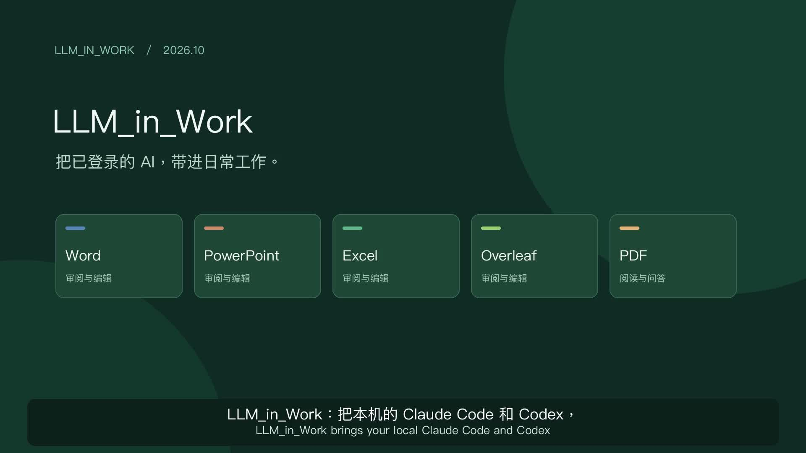
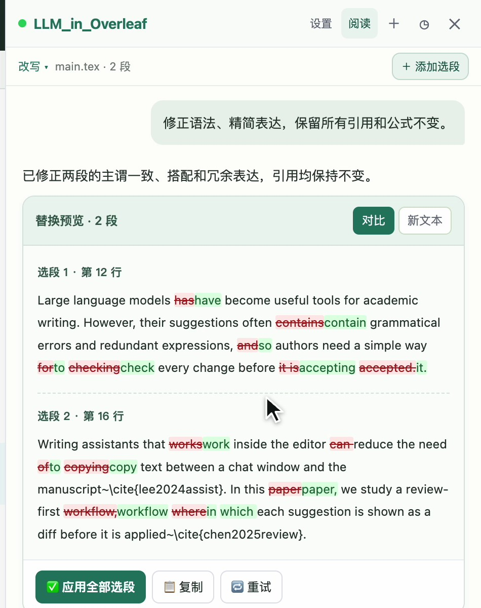
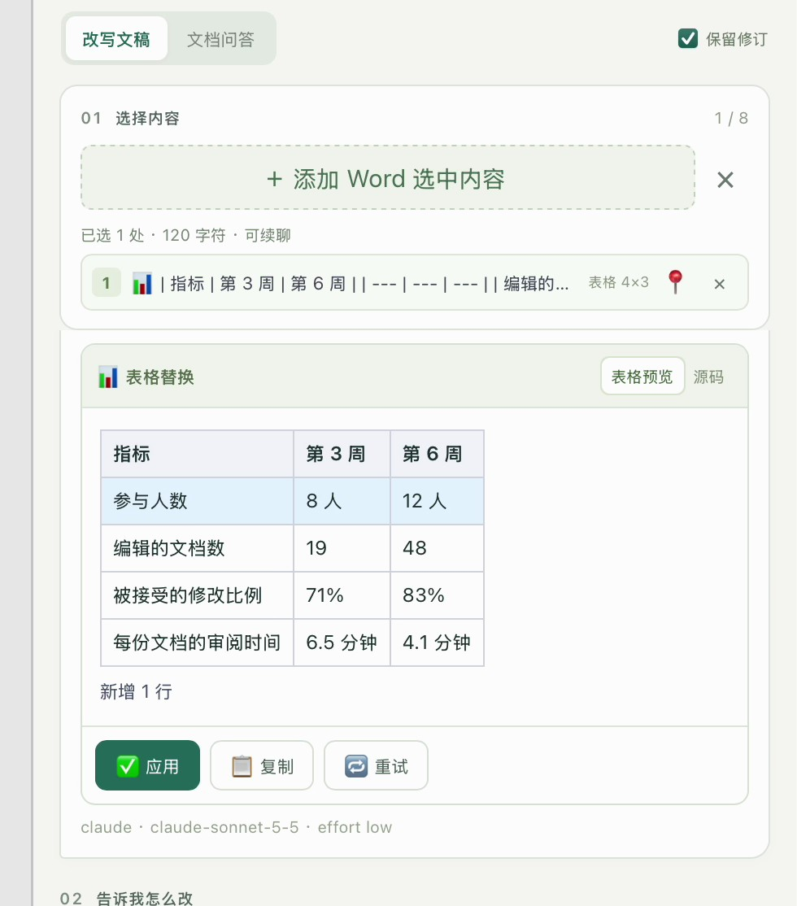
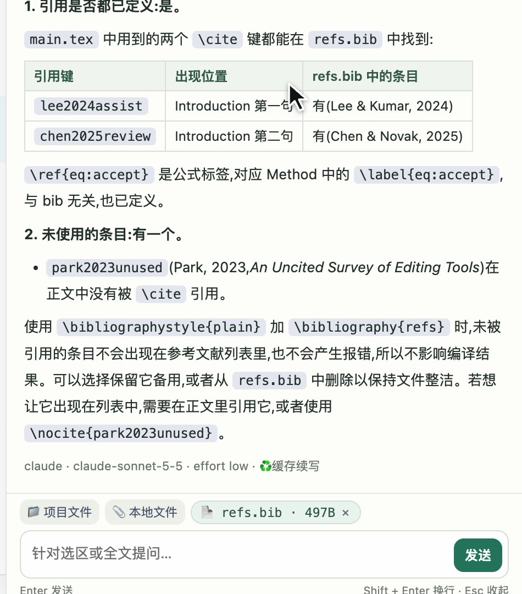
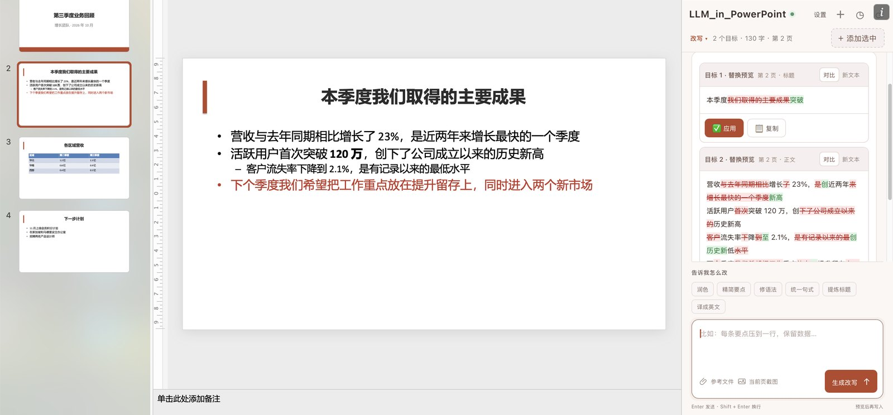
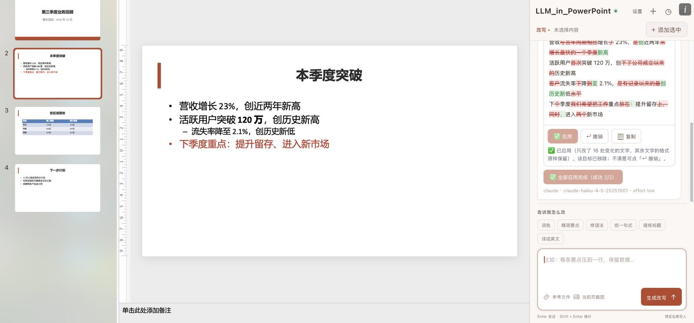
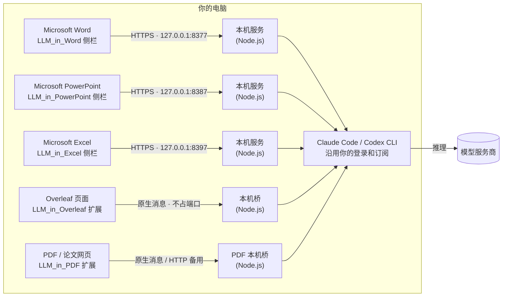

<div align="center">

# LLM_in_Work

**把你电脑上已登录的 Claude Code 和 Codex，带进 Word、PowerPoint、Excel、Overleaf 和 PDF 阅读器。**

编辑文档时先看差异再写回；阅读 PDF 时选中文字或框选图表，直接提问。不用在聊天窗口和文档之间来回复制，也不需要额外的 API Key。

[](https://github.com/ZJU-OmniAI/LLM_in_Work/actions/workflows/ci.yml)
[](LICENSE)
[](LLM_in_Word/README.zh-CN.md)
[](LLM_in_PowerPoint/README.zh-CN.md)
[](LLM_in_Excel/README.zh-CN.md)
[](LLM_in_Overleaf/README.zh-CN.md)
[](LLM_in_PDF/README.zh-CN.md)
[](#快速开始)

[English](README.md) · **简体中文**

</div>

[](https://github.com/ZJU-OmniAI/LLM_in_Work/releases/download/2026-10-07/LLM_in_Work_demo_zh_720p.mp4)

[▶ 观看五个助手演示（中文讲解）](https://github.com/ZJU-OmniAI/LLM_in_Work/releases/download/2026-10-07/LLM_in_Work_demo_zh_720p.mp4)

<p align="center"><sub>真实操作录屏，中文讲解，中英双语字幕 · <a href="README.md">English narration</a> · <a href="https://github.com/ZJU-OmniAI/LLM_in_Work/releases/tag/2026-10-07">下载 1080p 视频和字幕</a></sub></p>

## 亮点

- **不要 API Key，不用新注册。** 直接调用你电脑上已登录的 Claude Code 或 Codex 命令行工具，用的就是你现有的订阅。
- **先看差异，再动文档。** 每处修改都先以差异对比显示（红色是删除，绿色是新增），点「应用」之前，文档一个字都不会变。
- **按编辑器自己的方式写回。** Word 里写成真正的「修订」，可以在「审阅」里逐条接受或拒绝；PowerPoint 里只改动有变化的字词，字体、颜色和要点层级都保持原样；Excel 里只写入有变化的单元格，写法和手动输入一样，数字格式不变，`00123` 这样的编号仍是文本；这两者每处修改都能一键撤销；Overleaf 里整组修改作为一步写入，撤销一次就全部还原。
- **多段内容，一条要求。** Word 一次最多 8 段正文或整张表格；PowerPoint 一次最多 16 个文本框、表格或整页，可以跨页；Excel 一次最多 8 块单元格区域，也可以是要填写的空白列；Overleaf 可以把同一个 `.tex` 文件里不相邻的几段一起修改。
- **带着全文上下文。** 会把整篇文档、整份演示文稿、工作簿里的表格或整个 `.tex` 文件一起交给模型，术语、引用和公式能保持一致；需要时还能加上 `.bib`、其他章节或 PDF。
- **写回前再核对。** 写入前会重新核对原文，防止改错位置；表格和工作簿只改真正变化的行和单元格。Claude 调用不加载你本机的 MCP 服务并限制工具；Codex 使用只读沙箱，详情见安全说明。
- **PowerPoint 还能调版式、整页美化。**「调整版式」模式改格式不改文字：小到「把这个黑框改浅一点」，大到「把这一页整体美化」——把挤在一起的要点拆成卡片、统一字体字号和配色、图文分区。大改应用后自动截图自查一轮，撤销时整页原样换回。
- **不只改写，还能提问。** Word 的「文档问答」、PowerPoint 的「演示文稿问答」（写讲稿、查前后一致，还可以附上当前页截图）、Excel 的「表格问答」（总结、找异常、解释公式，注明单元格地址）和 Overleaf 的「问答」模式可以讨论全文，不会改动正文。
- **LLM_in_PDF 精读文档。** 在线 PDF、本地文件和论文网页都能阅读；选中文字或框选图表直接提问，支持 Markdown、公式、按文档保存会话和完整导出，PDF 原文保持不变。
- **中英文支持。** 四个编辑助手可切换界面语言；PDF 界面目前为中文，支持中英文提问和回答。

## 五个助手，覆盖写作与阅读

| | [LLM_in_Word](LLM_in_Word/README.zh-CN.md) | [LLM_in_PowerPoint](LLM_in_PowerPoint/README.zh-CN.md) | [LLM_in_Excel](LLM_in_Excel/README.zh-CN.md) | [LLM_in_Overleaf](LLM_in_Overleaf/README.zh-CN.md) | [LLM_in_PDF](LLM_in_PDF/README.zh-CN.md) |
| --- | --- | --- | --- | --- | --- |
| 在哪里用 | Microsoft Word 桌面版 | Microsoft PowerPoint 桌面版 | Microsoft Excel 桌面版 | Overleaf 的 Code Editor（`overleaf.com`、`cn.overleaf.com`） | Chromium 浏览器 PDF 阅读器和论文网页 |
| 怎么审阅 | 正文、表格差异预览，以 Word 修订写入 | 每个目标一份差异，只写入变化的字词，可一键撤销 | 每块区域一份单元格预览，只写入变化的单元格，可一键撤销 | 每个选段各有一份 LaTeX 差异，整组写入、一次撤销 | 只读问答，不修改 PDF 原文 |
| 一起修改 | 最多 8 个段落或表格 | 最多 16 个文本框、表格或整页，可跨页 | 最多 8 块区域（合计 4,000 个单元格），可以是要填写的空白列 | 同一 `.tex` 文件里多个不相邻的选段 | 选择文字，或附带最近最多 4 张框选图片 |
| 调整格式 | — | 「调整版式」：边框、填充、字体字号、对齐、表格、背景，以及整页美化（拆成卡片、统一配色），可一键撤销 | — | — | PDF.js 保留排版，Markdown 表格与 KaTeX 公式 |
| 提问 | 「文档问答」围绕全文提问 | 「演示文稿问答」，可附当前页截图 | 「表格问答」，回答注明单元格地址 | 「问答」模式，可带上项目里的其他文件 | 全文、选段与实际图表像素 |
| 支持平台 | Windows、macOS | Windows、macOS | Windows、macOS | Windows、macOS、Linux 上的 Chrome、Edge、Brave 等 Chromium 浏览器 | macOS/Linux 原生桥；Windows 使用 HTTP 后端 |
| 连接方式 | Office 加载项 → 本机 HTTPS 服务（`127.0.0.1:8377`）→ CLI | Office 加载项 → 本机 HTTPS 服务（`127.0.0.1:8387`）→ CLI | Office 加载项 → 本机 HTTPS 服务（`127.0.0.1:8397`）→ CLI | 浏览器扩展 → 原生消息（不占端口）→ CLI | 扩展 → 原生消息；可回退本机 HTTP（8765） |
| 界面语言 | English · 中文 | English · 中文 | English · 中文 | English · 中文 | 中文界面，中英文问答 |

## 效果一览

<table>
  <tr>
    <td width="50%"></td>
    <td width="50%"></td>
  </tr>
  <tr>
    <td><b>Word：</b>每个目标都有自己的差异预览，可以单独应用，也可以全部应用。</td>
    <td><b>Overleaf：</b>引用和公式保持不变，每个选段分别给出差异。</td>
  </tr>
  <tr>
    <td></td>
    <td></td>
  </tr>
  <tr>
    <td><b>表格：</b>新增一行只插入这一行，其他单元格保持原样。</td>
    <td><b>问答：</b>带上 <code>refs.bib</code>，检查引用是否都有定义。</td>
  </tr>
  <tr>
    <td></td>
    <td></td>
  </tr>
  <tr>
    <td><b>PowerPoint：</b>添加整页，标题和要点各有一份差异。</td>
    <td><b>应用之后：</b>只改有变化的字词，加粗的数字、要点层级和颜色都保持原样。</td>
  </tr>
  <tr>
    <td></td>
    <td></td>
  </tr>
  <tr>
    <td><b>Excel：</b>整理客户名和地区，预览里划掉每个旧值。</td>
    <td><b>填一整列：</b>按每行的反馈填好分类，格式不变。</td>
  </tr>
  <tr>
    <td></td>
    <td></td>
  </tr>
  <tr>
    <td><b>PDF：</b>选择段落，带着全文上下文提问。</td>
    <td><b>图表：</b>框选实际图像，让模型解释坐标、趋势和细节。</td>
  </tr>
</table>

截图都来自 macOS 上的真实应用：Word、PowerPoint、Excel 桌面版；Overleaf 部分是在本地演示页面里运行的真实扩展和 CodeMirror 编辑器（不是 Overleaf 官网）。Word、Excel 和 Overleaf 的截图取自演示录屏，回答由 Claude Code（Sonnet 5.5，low 思考强度）生成；PowerPoint 的截图单独拍摄，回答由 Claude Code（Haiku 4.5，low 思考强度）生成。新版视频介绍全部五个助手；PDF 部分使用合成文档、真实扩展和真实 CLI 回答。

## 工作原理



五座「桥」都在本机运行，项目本身不增加任何云端服务。模型推理在哪里进行，取决于你的命令行工具连接的服务商。

## 快速开始

**准备：** Node.js 22.13+（22.x）或 24+；至少安装并登录一个命令行工具：[Claude Code](https://code.claude.com/docs/en/setup)（`claude auth login`）或 [Codex CLI](https://github.com/openai/codex)（`codex login`）。

```bash
git clone https://github.com/ZJU-OmniAI/LLM_in_Work.git
cd LLM_in_Work
```

| | LLM_in_Word | LLM_in_PowerPoint | LLM_in_Excel | LLM_in_Overleaf | LLM_in_PDF |
| --- | --- | --- | --- | --- | --- |
| macOS | `cd LLM_in_Word && ./install.sh` | `cd LLM_in_PowerPoint && ./install.sh` | `cd LLM_in_Excel && ./install.sh` | `cd LLM_in_Overleaf && ./install.sh` | `cd LLM_in_PDF && ./install.sh` |
| Linux | 不适用（没有 Word 桌面版） | 不适用（没有 PowerPoint 桌面版） | 不适用（没有 Excel 桌面版） | `cd LLM_in_Overleaf && ./install.sh` | `cd LLM_in_PDF && ./install.sh` |
| Windows | 在 `LLM_in_Word` 目录运行：`powershell.exe -NoProfile -ExecutionPolicy Bypass -File .\install.ps1` | 在 `LLM_in_PowerPoint` 目录运行同一条命令 | 在 `LLM_in_Excel` 目录运行同一条命令 | 在 `LLM_in_Overleaf` 目录运行同一条命令 | 在 `LLM_in_PDF` 运行 `npm start` 并保持终端开启 |
| 然后 | 重启 Word，点 **开始 → 加载项 → 开发人员加载项 → LLM_in_Word** | 重启 PowerPoint，点 **开始 → LLM_in_PowerPoint**（或从 **开发人员加载项** 打开） | 重启 Excel，点 **开始 → LLM_in_Excel**（或从 **开发人员加载项** 打开） | 打开 `chrome://extensions`，开启 **开发者模式**，**加载已解压的扩展程序** → 选 `LLM_in_Overleaf/extension` | 加载已解压的扩展程序 → `LLM_in_PDF/extension` |

装哪个都行。macOS 上 LLM_in_PowerPoint 和 LLM_in_Excel 会沿用先装的 Office 助手已信任的本机证书（PowerPoint 版沿用 Word 版的；Excel 版沿用 Word 版或 PowerPoint 版的），所以先装 Word 版的话，全部装上也只需要输一次密码。带截图的详细步骤：**[LLM_in_Word](LLM_in_Word/README.zh-CN.md)** · **[LLM_in_PowerPoint](LLM_in_PowerPoint/README.zh-CN.md)** · **[LLM_in_Excel](LLM_in_Excel/README.zh-CN.md)** · **[LLM_in_Overleaf](LLM_in_Overleaf/README.zh-CN.md)** · **[LLM_in_PDF](LLM_in_PDF/README.zh-CN.md)**。

## 常见问题

**需要 API Key 吗？**
不需要。请求经过你已登录的 Claude Code 或 Codex 命令行工具，计入该账号的套餐或用量。

**模型会收到哪些内容？**
你的要求、选中的段落、整篇文档（Word）、整份演示文稿的文字（PowerPoint）、工作簿里的表格（Excel）或当前 `.tex` 文件（Overleaf）作为上下文，以及你附加的文件；PDF 问答会发送提取的全文、会话、选段及近期框选图片。选中段落只是限定写回位置，**不代表只把选区交给模型**。处理敏感文档前，请先阅读[安全与数据说明](SECURITY.md)。

**会不会不经确认就改我的文档？**
LLM_in_PDF 只读原文；其他助手点「应用」之前都只是预览。Word 里还能逐条拒绝修订；PowerPoint 和 Excel 里每张已应用的卡片都有「撤销」按钮；Overleaf 里撤销一次就能还原整组修改。

**支持哪些编辑器？**
Windows 和 macOS 上的 Microsoft 365 Word、PowerPoint、Excel 桌面版，以及 `overleaf.com`、`cn.overleaf.com` 的 Code Editor。Office 网页版、Overleaf 可视化编辑器和自建 Overleaf 默认不支持。

**这是 Microsoft、Overleaf、Anthropic 或 OpenAI 的官方产品吗？**
不是。这是 ZJU-OmniAI 独立维护的开源项目。

LLM_in_PDF 另支持 Chromium 浏览器里的在线、本地 PDF 与论文网页；各系统安装方式见子项目说明。

## 仓库结构

```text
LLM_in_Work/
├── LLM_in_Word/       Word 加载项、本机 HTTPS 服务、安装脚本
├── LLM_in_PowerPoint/ PowerPoint 加载项、本机 HTTPS 服务、安装脚本
├── LLM_in_Excel/      Excel 加载项、本机 HTTPS 服务、安装脚本
├── LLM_in_Overleaf/   浏览器扩展、原生消息本机桥、安装脚本
├── LLM_in_PDF/        PDF 阅读器扩展、原生 / HTTP 桥、测试
├── SECURITY.md        数据去向，以及如何调用命令行工具
└── CONTRIBUTING.md    各子项目的测试和 CI
```

各桥程序使用 Node 内置模块；LLM_in_PDF 随扩展打包了 PDF.js、Markdown-it、KaTeX 及许可证。离线测试使用模拟 CLI 和合成文档，[CI](https://github.com/ZJU-OmniAI/LLM_in_Work/actions) 在 Linux、macOS、Windows 上运行。详见[参与开发](CONTRIBUTING.md)和[更新记录](CHANGELOG.md)。

## 许可证

[MIT](LICENSE)。Office.js、Overleaf、各模型命令行工具及其服务，仍分别遵循各自的条款。
